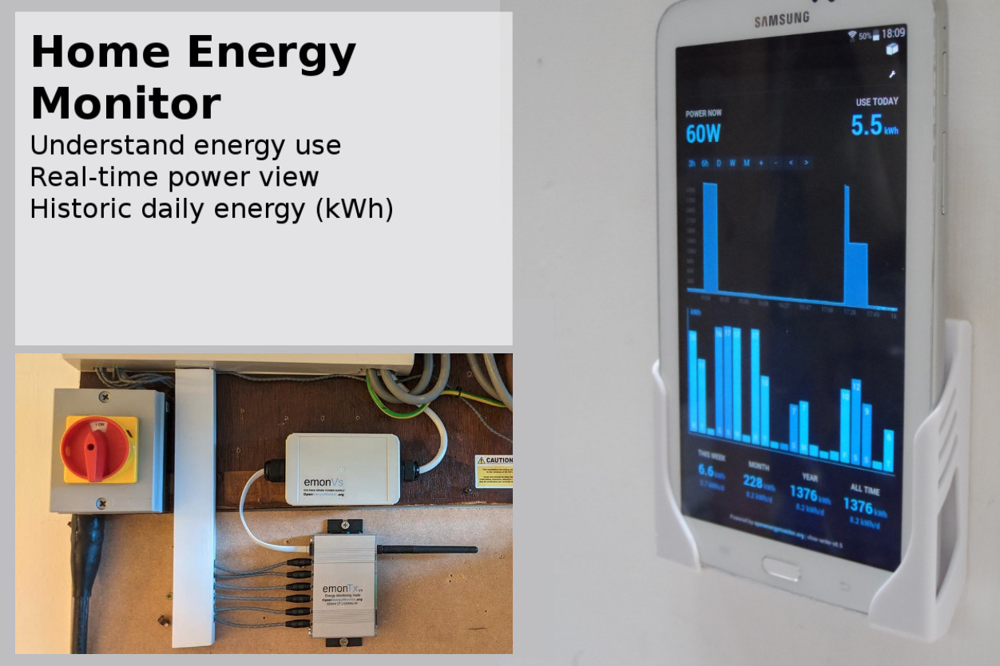

# Home Energy Monitoring

The OpenEnergyMonitor system can be used as a simple home energy monitoring system for understanding energy consumption.

- View and explore real-time power and daily energy consumption in kWh.
- MyElectric is a web app which runs on [Emoncms](https://Emoncms.org). 
- MyElectric is also available as a native [Android app](https://play.google.com/store/apps/details?id=org.emoncms.myapps&utm_source=global_co&utm_medium=prtnr&utm_content=Mar2515&utm_campaign=PartBadge&pcampaignid=MKT-Other-global-all-co-prtnr-py-PartBadge-Mar2515-1)



## 1. Hardware

**emonTx4**<br>
Our latest energy monitoring unit is called the emonTx4. With 6x clip-on CT sensor channels it can be used to monitor the main supply and several other circuits in a house. 

The emonTx4 also measures voltage using the emonVs precision voltage sensor and power supply. Voltage sensing ensures accurate measurement of active power, which is what is usually billed for.

For a more detailed overview of the emonTx4, please see: [EmonTx4: Overview](../emontx4/overview.md).

The emonTx4 can be used in two configurations: 

1\. The emonTx4 transmits it's measurement data via a 433 MHz radio link to an emonBase base-station, which is then either connected to the local network via WiFi or Ethernet. This provides full local data logging and visualisation capability - as well as the option to forward the data to a remote server. For more information, please see:

- [emonTx4, emonVs & emonBase installation guide](../emontx4/emontx4_emonbase_install.md)
- [emonTx4 shop item](https://shop.openenergymonitor.com/6-channel-energy-monitoring-emontx-v4)

2\. The emonTx4 can alternatively used in stand-alone mode with a WiFi adapter board. This is more suited for data logging on a remote server such as our [emoncms.org](https://emoncms.org) service. For more information, please see:

- [emonTx4 ESP8266 Wi-Fi Expansion Board](https://docs.openenergymonitor.org/emontx4/expansion_boards.html#adafruit-esp8266-huzzah-wi-fi-expansion-board)
- [emonTx4 WiFi shop item](https://shop.openenergymonitor.com/emontx-v4-with-onboard-wifi/)


## 2. Sensor Installation

See [emonTx4 > Install](../emontx4/emontx4_emonbase_install.md) section of the setup guide.

```{warning}
[Please read the CT installation guide before installing.](../electricity-monitoring/ct-sensors/installation.md)
Your safety is your responsibility. Clip-on current sensors are non-invasive and should not have direct contact with the AC mains. However, installing the sensors will require working in close proximity to cables carrying high voltage. As a precaution, we recommend ensuring the cables are fully isolated, i.e. power is switched off, prior to installing your sensors, and proceeding slowly with care. If you have any doubts, seek professional assistance.
```

```{note}
The clip-on CT sensors must be clipped round either the live or Neutral AC wire. <strong>Not both</strong>.
```

*While the images below show the original blue CT sensors, our latest CT sensors for the emonTx4 are different in appearence but the principle of the image is the same.*


```{note}
The polarity of the power readings depends on the orientation of the clip-on CT sensor. Orientate the CTs so that site-consumption is positive. The correct orientation can be determined by the arrow printed on the body of the CT sensor.
```


## 3. Emoncms Feed Setup

See [Emoncms > Log Local](../emoncms/intro-rpi.md) section of the setup guide.

For automatic MyElectric App setup use the suggested feed names below. **The names are case sensitive.**

**Assuming CT1 (P1) = site-consumption**

 1. Click on spanner icon to configure `emonTx4_17/P1`.
 2. Select `log to feed` and create a feed called `use` with the feed engine set to PHPFina and feed `interval=10s`.
 3. Select `power to kwh`, create a feed called `use_kwh` with feed engine `PHPFina` and feed `interval=10s`.

## 4. Configure MyElectric App

With your inputs configured as above and with use of the suggested feed names the MyElectric app will launch with no further configuration required.

Alternatively the MyElectric app will automatically show the configuration screen if it can't detect the expected feeds. It's then possible to select feeds from the drop down feed selector menus:

Once the required feeds are selected, the Launch App button will appear.


## My Electric App 

The main view shows a moving window power view of site-consumption in the top half and historic daily energy consumption in kWh in the bottom half.

**Energy View**


**Cost View**


