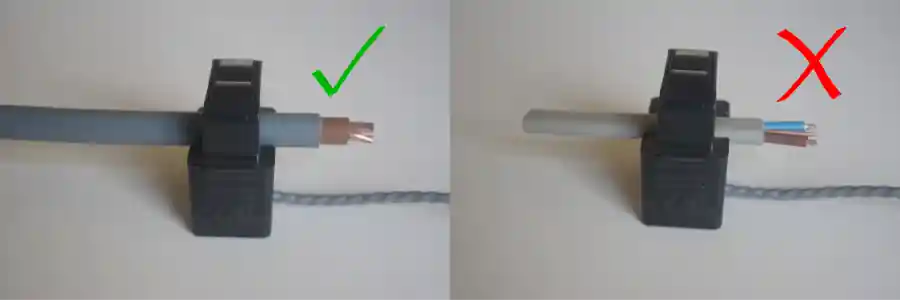

# Current Transformer Installation

**THE CURRENT TRANSFORMER MUST BE INSTALLED ON A SINGLE CURRENT-CARRYING WIRE…**



…as in the left-hand picture.

If you put it on a twin-core, or any multi-core cable, as in the right-hand picture, then it will measure the sum of the currents in each of the conductors. In the case of a twin-core or twin-core & earth cable, the same current will be flowing in opposite directions and the sum will be zero. This is almost certainly not what you want.

<!-----------------------------Warning----------------------------------------->

```{warning}

Please read the whole of this page, and especially the warnings at the end, before touching the mains cables! Your safety is your responsibility. Clip-on current sensors are non-invasive and should not have direct (metallic) contact with the AC mains. However, installing the sensors will require working in close proximity to cables carrying high voltage. As a precaution, we recommend ensuring the cables are fully isolated, i.e. power is switched off prior to installing your sensors, and proceeding slowly and with care. If you have any doubts, seek professional assistance.

```

<!-----------------------------/Warning---------------------------------------->

**Does the direction the CT is clipped on the wire, matter?**

If you are interested in reading only apparent power, and you don’t have an emonVs or an AC-AC adapter, it does not matter. The power reading will always be positive.

If you want to read real power, and you want to know in which direction power is flowing – e.g. when you generate your own electricity, and want to know whether you are importing or exporting – then the CT must face the correct direction. Our convention is: imported and generated powers are positive. If the CT faces the wrong way, it means that the power you expect to be positive will be shown as negative. [Note: Robin Emley had adopted the opposite convention for his Mk 2 energy diverter – he regarded exported power as positive.]

For the emonTx4 and later, and the emonPi2 and later, used with the emonVs and the Echun CTs purchased from the [shop](https://shop.openenergymonitor.com/ct-sensors/) and when the CT is on the line conductor, the arrow on the bottom of the CT should point in the direction of power flow, i.e. the letter ‘K’ is towards the supply and the letter ‘L’ is towards the load to give a positive reading. In the picture above, positive power flow is from left to right. 

For the earlier emonTx V2 & V3 used with the UK ac-ac adapter and the blue YHDC CT purchased from the shop and when the CT is on the line conductor, the printing on the face of the CT should face in the direction of positive power. In the picture below, positive power flow is from left to right. 


If the CT is on the neutral conductor (this is only valid on a single-phase installation) it should face in the opposite direction. For any other combination of a.c. voltage reference (ac-ac adapter) and CT it is possible, if the phasing of each is known, to determine the correct orientation, but the easiest and quickest method is probably by trial and error. Reversing the CT will change the sign of that input. Reversing the ac-ac adapter (where the plug design or wiring allows this) will change the sign of all inputs.

---

## The Details

### What is a Current Transformer?

A current transformer is similar to the more common voltage transformer that we are all familiar with. It has an iron or ferrite core and two windings. But unlike the voltage transformer, it comes with only one winding, on the secondary side. You supply the primary winding in the form of the cable that passes through the transformer core. And, as the name suggests, it works on currents, not voltages. Therefore it will generate an output current flowing in the secondary winding that is proportional to the current in the cable that is the primary winding. The CT will generate whatever voltage is necessary to drive that current – within limits of course. See “Warnings” below.

### Types of Current Transformer

There are two types, they operate in exactly the same way, the difference is in their construction. Within each of these two types are two sub-types, the conventional current-output type that must be provided with a burden – traditionally an ammeter but it can equally be a resistor, and the voltage-output type in which the burden resistor is enclosed within the body of the CT.

1. The Ring-core Current Transformer. The core is solid, and the cable you wish to put it on needs to be disconnected in order to install the CT. Therefore, it’s used only where it’s practical, safe and legal to disconnect the circuit. Its advantage is higher accuracy and generally, it’s smaller for the same rating.
  
2. The Split-core Current Transformer. The core is in two parts held together by clips or screws. The two parts are simply placed around the cable and assembled. There is no need to disconnect anything. Provided the current transformer has a burden connected internally or externally, it can be installed on a live, insulated, current-carrying cable.

### How a CT works

A wire carrying an electric current sets up a magnetic field around it. The wire forms the primary winding of the transformer. The iron (or ferrite) transformer core concentrates the field and couples it to the secondary winding and, provided the magnetic field continually changes, causes a current to flow in that winding too. This current flows in the burden resistor, which generates a voltage the emonTx or emonPi can use. A current transformer will **not** measure direct current.

A current transformer is similar to the more common voltage transformer that we are all familiar with. It has an iron or ferrite core and two windings. But unlike the voltage transformer, it comes with only one winding, on the secondary side. You supply the primary winding in the form of the cable that passes through the transformer core. And, as the name suggests, it works on currents, not voltages. Therefore it will generate an output current flowing in the secondary winding that is proportional to the current in the cable that is the primary winding. The CT will generate whatever voltage is necessary to drive that current – within limits of course. See “Warnings” below.You can pass more than one wire through the opening of a current transformer if you want the sum (more specifically, the **vector sum**) of the currents. There are two common instances where this is useful:

1. You have a small current and it is difficult to get an accurate reading. In this case, the wire diameter is small. It’s possible to wind it into a coil and the CT can be fastened to the coil, or the wire can be passed though the CT opening several times in the same direction, effectively multiplying the current by the number of turns passing through the core. You can correct the reading by changing the calibration of that input.
    
2. You have many small loads on different circuits, and you want to measure the total current used by those circuits. All the circuits must be on the same phase, and all the wires must pass through the CT in the same direction. If one wire passes through the CT in the opposite direction, the current in that wire will be <u>subtracted</u> from the total.

### Warnings

If an unburdened CT (i.e. a current-output type without a burden resistor) is attached to a current-carrying conductor, the CT will generate an unsafe voltage at its leads which could break down the insulation and destroy the CT.

The voltage-output type with its burden resistor permanently connected internally is immune from this problem.

The YHDC transformer previously sold in the Shop (but still generally available) has internal Zener diodes to limit the maximum unburdened voltage output to a safe level. CTs with internal burden resistors (‘the voltage output’ type) are also protected against developing dangerous voltages.

Unless you are absolutely certain it is the voltage-output type...

**Always** connect the CT leads before clipping it round a current-carrying conductor, and always un-clip the CT from the current-carrying conductor before disconnecting its leads.

**Never** open-circuit a CT  whilst it is on a current-carrying conductor. 

It is **always** safe to short-circuit a CT (either type).

**Never** attempt to fit a CT to a bare conductor unless you are absolutely certain it is designed for this duty. Apart from the obvious danger of electric shock, there are two factors to be considered: the strength of the CT’s insulation, and its ability to withstand the higher temperatures at which bare conductors normally operate.

A split-core CT, especially one that has a ferrite core (such as the ones sold in the OEM Shop) should **never** be “clamped” to the cable using any sort of packing material, because the brittle nature of the ferrite core means that it might easily be broken, thus destroying the CT. You should only clamp the CT to the cable or busbar if the housing is specifically designed to do so. Similarly, a ring-core CT should **never** be forced onto a cable that is too large to pass freely through the centre. The position and orientation of the cable within the CT aperture makes no practical difference to the output.rge to pass freely through the centre. The position and orientation of the cable within the CT aperture makes no practical difference to the output.

_**If any part of your wiring looks like this:**_


then you must get professional advice. Even though the meter shown above was (presumably) installed and sealed by the electricity distribution authority, it is dangerous and illegal because a bare conductor is exposed.

(Exposed copper is visible on both the line and neutral conductors. Just because the worst is the neutral conductor is no excuse. If the neutral is damaged and broken anywhere on the supply side of this meter then that neutral will become live at the full mains voltage if anything is switched on downstream.)
