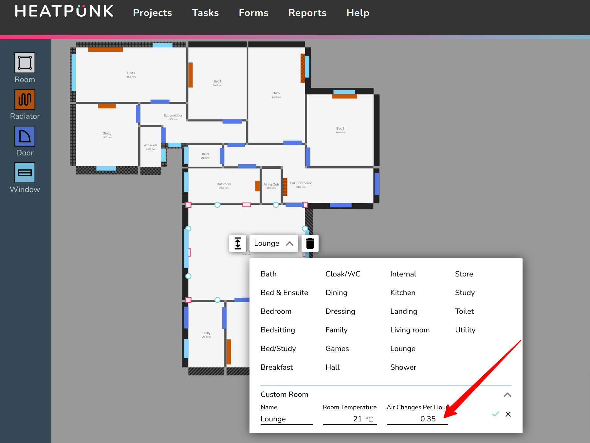
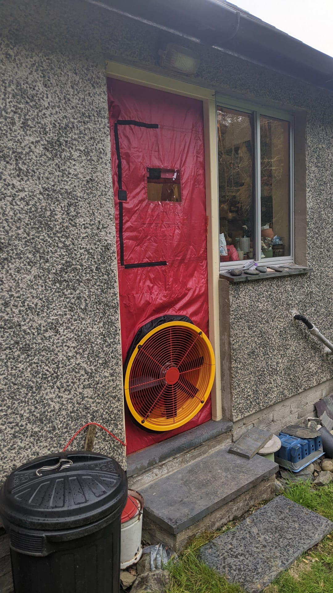

# 1980s Bungalow, 5kW Vaillant Arotherm+

**HeatpumpMonitor.org:** [System 75](https://heatpumpmonitor.org/system/view?id=75).

This system achieved an SPF H4 of 4.4. (3.8 for hot water, 4.5 for space heating). Probably the most important factor that made this performance possible is the **design flow temperature of 40°C** and crucially weather compensation set to match. 

This design temperature was in turn made practical by an [accurate heat loss calculation](https://docs.openenergymonitor.org/heatpumpmonitor/measured_heat_loss.html#accurate-vs-default-cibse-heat-loss-calculations) that placed the **heat loss for the building at 4.6 kW**. *There is an extension to this house that is mostly unused and has radiators in that part turned off or low, the measured heat demand for the remaining 80% of the house that is heated is 3.6 kW [[Open heat demand tool].](https://heatpumpmonitor.org/heatloss?id=75)* 

Two radiators were upgraded to K2's, others were kept as original (a mix of types). Three additional new radiators were installed in place of the old storage heaters in the living room hidden behind the sofas. There are 11 radiators in total and 14 room/spaces. 

Taking into account our measurements for the real world maximum output during defrost conditions of the 5kW Vaillant Arotherm+ of ~4.9 kW. The heat pump provides a **comfortable 36% (1.36x) margin** on top of the measured heat demand for the used part of the house. This would drop to about 7% if the whole house was heated.

The system is a simple **open loop**, single zone system controlled with Vaillant pure weather compensation. Unused rooms have TRV's dialled down or off. **Anti-freeze values** were used for freeze protection, the system was flushed well and filled with pure water + inhibitor only (no glycol).

Short and well insulated external primary pipework help keep losses to a minimum. Internal primary pipework up to the 3 port valve and hot water cylinder is also insulated well. Primary pipework all 28mm.

System achieves a slightly better than average [% of ideal Carnot COP or practical efficiency factor](https://docs.openenergymonitor.org/heatpumpmonitor/prc_carnot.html) at 50.3%.

## Key Stats

|Property |Value|
|---|---|
|SPF H4|4.4|
|Space heating only|4.5|
|Hot water only |3.8|
|Proportion hot water|5.7% (low)|
|||
|Measured heat loss (used)|3.6 kW|
|Calculated heat loss|4.6 kW|
|Defrost max output|4.9 kW|
|||
|Rated output of radiators|17.3 kW|
|Rated output of radiators (used)|~15 kW|
|||
|Weighed average flow temperature|34°C|
|Weighted average flow minus outside temperature|26.2°K|
|Weighted average outside temperature|7.8°C|
|Weighted average % carnot |50.30%|
|||
|Design flow temperature|40°C (correct)|
|Design outside temperature |-3°C|
|Weather comp curve |0.5|
|||
|Mean flow temp on coldest day |37.6°C|
|Max flow temp on coldest day |39.7°C|
|Outside temperature|0.0°C|
|Internal temperature coldest day|20.4°C|

## Default CIBSE comparison

*The [default CIBSE heat loss](https://docs.openenergymonitor.org/heatpumpmonitor/measured_heat_loss.html#accurate-vs-default-cibse-heat-loss-calculations) for this property would have been ~7.5 kW (A combination of CIBSE category A air change rates and higher target temperatures in some of the unused rooms and bathroom). More often than not this would result in a 10 kW heat pump being installed, 2.8x the actual heat loss.*

*The system would have likely been designed to a design flow temperature of 50°C, which would have coincidentally resulted in the roughly the same size radiators being upgraded/installed, but with weather comp set to match the design calculation the potential performance benefit of those rads would not have been realised.*

*Combining the significantly oversized heat pump with the wrong weather comp setting this system might have only delivered around SPF 2.9-3.2. This said with some tuning of weather compensation to match actual heat demand it would have been possible to salvage the performance and get the SPF up to around 3.5-3.8.*

## Learn more

**YouTube:** [Solid Fuel to Vaillant Air Source Heat Pump: 1980s Bungalow](https://www.youtube.com/watch?v=bHsp7fDw_bg)

- 0:00 Introduction
- 0:50 Heat loss calculation using the [heatpunk.co.uk](https://heatpunk.co.uk) tool. This part includes a discussion of:
    - Setting lower air change rates again based on the blower door test results. 
    - Heat pump selection, why Glyn choose a 5kW Vaillant Arotherm.
    - Radiator upgrades in order to run at lower flow temperatures.
- 4:58 Removal of old hot water system
- 6:40 Installation of new cylinder, primary pipework & heat pump. 
- Note anti-freeze valve detail at 10:25 and 11:44.
- 12:05 Radiators
- 16:22 Installation complete
- 16:53 Vaillant controller settings & heating curve (0.5)
- 19:43 Monitoring & performance

**YouTube:** [1980's Solid Fuel Bungalow to Heat Pump Winter Performance Update](https://www.youtube.com/watch?v=3dzk0QLCTm8)

*Vaillant System Settings*
- Heat curve: 0.5
- Room temp mod: disabled 
- Daytime set point: 21C
- Nighttime setback: 20.5C 
- DHW set point: 42C
- DHW operation mode: time schedule   
- DHW schedule: mid-afternoon in the summer and midnight in the winter 

## Pictures

The house on a particularly snowy day!

Heat loss calculation in [HeatPunk](https://heatpunk.co.uk), air change rate based on blower door test.

The blower door test, thanks to Toby Keep [https://www.walesbuildingperformance.co.uk](https://www.walesbuildingperformance.co.uk).

