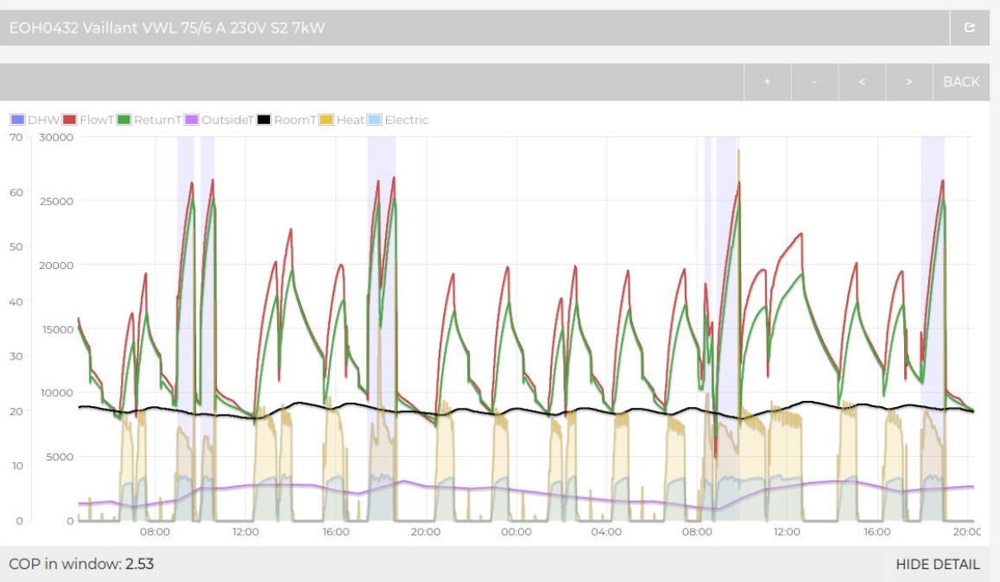
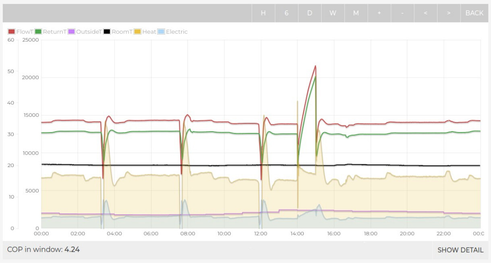

## The importance of commissioning and optimisation (getting the right control settings!)

Contrasting the [Electrification of Heat](https://eoh.heatpumpmonitor.org/) data with HeatpumpMonitor.org systems, one thing that really stands out, is the large number of Vaillant systems with radiator upgrades that were still performing quite poorly. We’ve become accustomed to seeing Vaillants perform very well on HeatpumpMonitor.org and so this was quite a surprise.

[EOH0432](https://eoh.heatpumpmonitor.org/emoncms/app/view?name=EOH0432&readkey=ff3f80ff86a1c54ff9ace1f841e6171e&mode=power&start=1643517300&end=1643660160) a 7kW Vaillant Arotherm+ (SPF 2.6) is a great example, we can see from the data that the weather compensation curve is set too high, the unit comes on ramps hard to try and reach the high curve value, the house reaches the thermostat set point and turns the heat pump off before it even reached the weather compensation temperature, the cycle then repeats. Dropping the curve on this system should improve performance significantly.

On the one hand it should not be a surprise that we see a lot of systems running hotter than they need to. An over-inflated heat loss together with a high design temperature, which is then used for setting the weather compensation settings, will result in a running pattern a bit like this.

That said a closer look at this particular example indicates a particularly high curve setting that is way in excess of it's design flow temperature! The design flow temperature is a reasonable 45°C. The curve setting also appears to be in excess of the factory default setting, which should result in stabilizing flow temperature around 42-45°C at an outside temperature of 5°C. This curve looks closer to 2 or 2.5.

We can contrast this with a high performing Vaillant Arotherm at a similar outside temperature on HeatpumpMonitor.org that has a tuned weather compensation curve amongst other control optimisation, we either see steady flow temperatures or good cycling with steady periods, typically running at 32-35C flow temperatures, a curve close to 0.5. The COP will be around 4.

