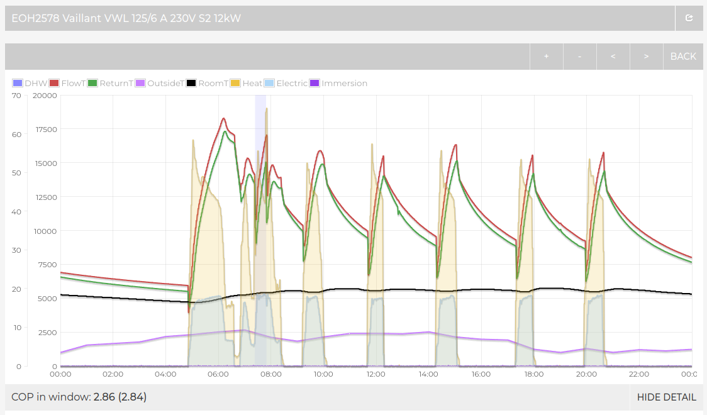
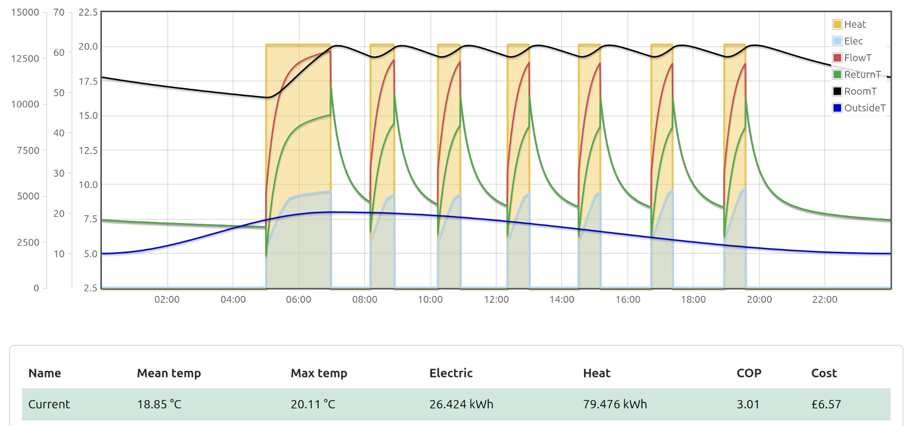
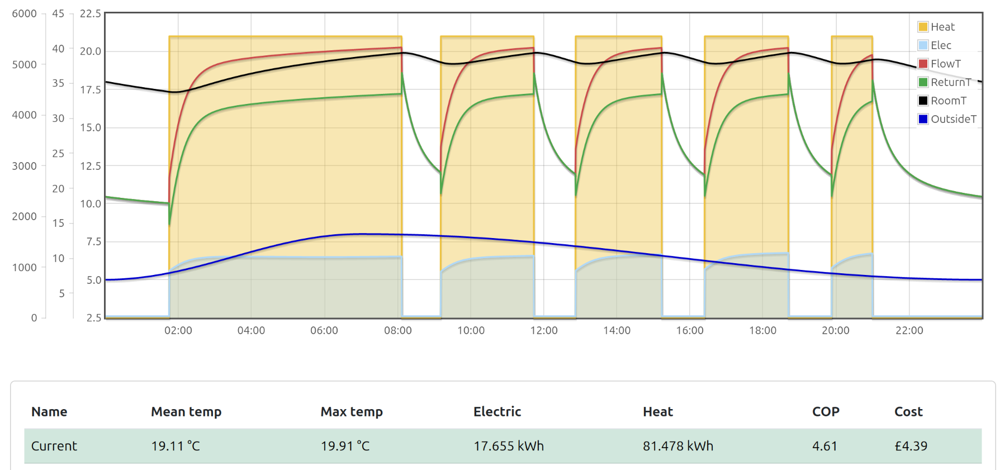
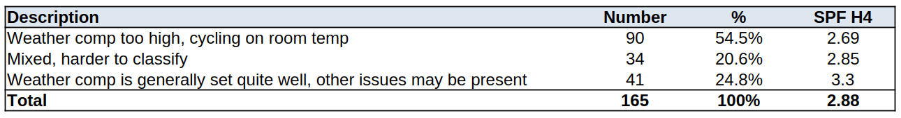

# Analysis of Electrification of Heat trial data

Perhaps one of the more notable headline results from HeatpumpMonitor.org, is the relatively high average performance of the systems on the site. At the time of writing, the 170 air source heat pumps with a full year of data are currently running at an average Seasonal Performance Factor (SPF), H4 boundary of 3.86 [[1]](https://heatpumpmonitor.org/?period=custom&filter=query:cooling_heat_kwh:1:lt:t,boundary:H4:eq:t,hp_type:air:eq:t).

This result is in contrast of course with the other trials such as the recently published Electrification of Heat trial, which found an average SPF H4 of 2.81 for 428 air source heat pumps [[2]](https://es.catapult.org.uk/report/electrification-of-heat-summary-reports-and-datasets). Previous trials also recorded low average performance results. The following table compares the results from these wider trials to the HeatpumpMonitor.org result:

| Trial/project name     |  Number of systems | Mean ASHP SPF H4    |
|------------------------|-------|----------------|
| **HeatpumpMonitor.org [[1]](https://dev.heatpumpmonitor.org/?filter=query:hp_type:air,boundary:h4)**   | 170 | **3.86**             |
| Electrification of Heat [[2]](https://es.catapult.org.uk/report/electrification-of-heat-summary-reports-and-datasets) | 428 | 2.81           |
| RHPP [[3]](https://doc.ukdataservice.ac.uk/doc/8151/mrdoc/pdf/8151_decc_rhpp_detailed_analysis_report.pdf)                    | 297| 2.36           |
| EST [[4]](https://www.icax.co.uk/pdf/The_heat_is_on_EST_report.pdf)                     | 15 | 2.45           |

The performance gap that we see here is clearly significant and at price cap electricity rates makes a big difference to the economics of heat pumps. An SPF of 2.8 provides cost parity running costs to gas when you include the saving from removing the gas standing charge as well, an SPF of 3.86 provides substantial savings, ~£220/year for an average household or 26%. Many are also combining high efficiency with time of use tariff optimisation providing even grater savings.

The big question that the HeatpumpMonitor.org results raises is: **Why do we see this large difference in performance?**

Thankfully the Electrification of Heat trial team made all of the detailed electric, heat metering and system temperature data available at 2-minute resolution. The following presents our analysis of this data so far.

In order to make analysis of the Electrification of Heat trial data easier, we started by importing all of the detailed data into a simplified version of the HeatpumpMonitor.org website. This site enables visualisation of each system using the Emoncms MyHeatpump dashboard and is available here:

[https://eoh.heatpumpmonitor.org](https://eoh.heatpumpmonitor.org/
)

## High level error detection

**Data issues and correction:** A few initial data issues were identified on 13% systems, such as the heat from some hybrid gas boiler systems being included as heat pump heat output and immersion heater electric consumption not always following the expected convention. These issues alongside issue descriptions are highlighted in the *Error* column and corrections provided in the *Adj H4* column. While initially surprising the overall impact of these corrections to the mean air source performance result is very minor, with only a reduction from a mean SPF H4 of 2.81 to 2.80.

**Defrost losses not included:** The EoH data for cumulative heat energy delivered does not show a brief dip due to heat lost to defrosts. This is consistent with the result we would expect from using heating only heat meters (the default type supplied by heat meter suppliers). HeatpumpMonitor.org performance figures do have this heat lost to defrosts subtracted from the total heat delivered and in our experience the difference between including and not including defrost losses is typically a reduction is SPF of about 0.1 over the year. This suggests that the mean EoH SPF H4 could be ~2.7 with defrost losses subtracted.

**Weighted averages:** A number of additional metrics were calculated for each system including: weighted average system temperatures (by heat delivered), % of ideal carnot COP and metrics useful for error detection such as % of heat delivered below a COP of 1 or above a COP of 10. 

**Low % of ideal Carnot:** A substantial fraction of systems have very low % of ideal carnot COP values (10% off systems below 35%, 36% below 40%, 80% below 45%). This indicates that a large proportion of systems are delivering lower than expected performance for the system temperatures that these systems ran at. Why this is the case needs more investigation and in particular to understand if there is an issue with under-reading heat meters. Most of the heat meters used in the trial were Sontex heat meters that can under-read flow rate if system water quality is poor. Mean performance results would improve if this was the case.

## Sub-optimal weather compensation issue

**Weather compensation set too high, cycling on room temperature**

One of the first things that jumps out at you when looking through the detailed data is the large number of systems that are running in ways that are far from optimal. 

Particularly surprising is the large number of Vaillant Arotherm systems with radiator upgrades performing badly. We have become accustomed to seeing Vaillants performing really well on HeatpumpMonitor.org. The following analysis focuses on these Vaillant systems.

The following example from system EOH2578 is illustrative of one common issue seen across a fairly large proportion of Vaillant systems in the study. 

The key issue here is that the system is ramping up to much higher flow temperatures than required, the system is then cycling on room temperature, turning on and off on the thermostat. 



**Dashboard link:** [https://eoh.heatpumpmonitor.org/emoncms/EOH2578/app/view?mode=power&start=1645488000&end=1645574400](https://eoh.heatpumpmonitor.org/emoncms/EOH2578/app/view?mode=power&start=1645488000&end=1645574400)

The long off periods (~1.5 hrs) visible between the high temperature cycles together with the fact that the compressor is running at near full capacity when it is running, indicates an opportunity for the system to deliver the same amount of heat and comfort by running at a lower flow temperature and at a lower compressor modulation. This would result in a substantial improvement in performance.

The pattern seen here of the flow temperature ramping up to a higher flow temperature than required is consistent with either the weather compensation setting being set too high or the system being ran with a high fixed flow temperature target. The flow temperature and compressor modulation can be reduced by reducing the weather compensation curve setting and turning weather compensation on if not currently in use.

**Simulated performance results:**
To get an idea of the performance improvement that might result from this change, we can simulate this system using our [dynamic heat pump simulation tool](https://openenergymonitor.org/tools/dynamic_heatpump_v1.html). 

Use the following parameters to simulate the illustrative example from system EOH2578 above:

- A heat pump COP model based on interpolation of the detailed data tables provided for the 12 kW Vaillant Arotherm+ available in the Czech datasheets.
- Building heat loss of 6.9 kW.
- Radiator rated output at ΔT50 of 22 kW.
- Room set point control enabled with a schedule targeting 19.6°C between 5am and 9pm.
- Outside temperature averaging 6.5°C with a 4°C oscillation,
- System volume of 120L

To reproduce the pattern observed of the heat pump running at near max output during the brief run periods, the Vaillant heat pump is simulated as having a fixed compressor at 74% modulation, this provides blocks of heat output at ~13 kW which is close to that observed in the EOH2578 example.

For ease of reproduction the following JSON configuration can be imported into the tool:

```
{"days":4,"building":{"heat_loss":6900,"internal_gains":390,"fabric":[{"proportion":52,"WK":576.9230769230769,"kWhK":48,"T":16},{"proportion":28,"WK":1071.4285714285713,"kWhK":8,"T":17},{"proportion":20,"WK":1499.9999999999998,"kWhK":4,"T":18}],"fabric_WK":299.99999999999994},"external":{"mid":6.5,"swing":3,"min_time":"00:00","max_time":"07:00"},"heatpump":{"capacity":17900,"system_water_volume":120,"flow_rate":12,"system_DT":5,"radiatorRatedOutput":22000,"radiatorRatedDT":50,"prc_carnot":47,"cop_model":"vaillant12","standby":30,"pumps":15,"minimum_modulation":40},"control":{"mode":"3","wc_use_outside_mean":1,"Kp":2500,"Ki":0.2,"Kd":0,"wc_Kp":500,"wc_Ki":0.05,"wc_Kd":0,"curve":1,"limit_by_roomT":true,"roomT_hysteresis":0.6,"fixed_compressor_speed":74},"schedule":[{"start":"00:00","set_point":10,"price":24.86},{"start":"05:00","set_point":19.6,"price":24.86},{"start":"21:00","set_point":10,"price":24.86}]}
```

This simulation run, yields a COP of 3.01, slightly higher than the COP of 2.86 observed in reality: 



To assess the impact of optimizing the weather compensation curve, the simulation was repeated with the compressor speed reduced to the minimum required to maintain the indoor temperature set point. The schedule is also revised to start earlier in order to maintain the indoor temperature at the expected set point for the same period of time.

We typically see the 12 kW Vaillant Arotherm+ modulate down to ~5.5 kW of heat output on HeatpumpMonitor.org. This is reproduced in the simulator by setting the fixed compressor modulation to 31%. We need to move the schedule starting time forward from 5am to 1:45am to meet the same 19.6C average room temperature between 6:45am and 8:45pm.

This results in a COP of 4.61, demonstrating a substantial improvement in performance from this simple adjustment. The electricity consumed is reduced significantly, from 26.4 kWh down to 17.7 kWh. The morning peak in electricity demand is moved further into the off-peak period, and the peak demand at 6am is reduced from 5.1 kW down to 1.2 kW, providing further benefits to the wider energy system.



Import the following JSON configuration into the tool to reproduce:

```
{"days":4,"building":{"heat_loss":6900,"internal_gains":390,"fabric":[{"proportion":52,"WK":576.9230769230769,"kWhK":48,"T":16},{"proportion":28,"WK":1071.4285714285713,"kWhK":8,"T":17},{"proportion":20,"WK":1499.9999999999998,"kWhK":4,"T":18}],"fabric_WK":299.99999999999994},"external":{"mid":6.5,"swing":3,"min_time":"00:00","max_time":"07:00"},"heatpump":{"capacity":17900,"system_water_volume":120,"flow_rate":12,"system_DT":5,"radiatorRatedOutput":22000,"radiatorRatedDT":50,"prc_carnot":47,"cop_model":"vaillant12","standby":30,"pumps":15,"minimum_modulation":30},"control":{"mode":"3","wc_use_outside_mean":1,"Kp":2500,"Ki":0.2,"Kd":0,"wc_Kp":500,"wc_Ki":0.05,"wc_Kd":0,"curve":1,"limit_by_roomT":true,"roomT_hysteresis":0.6,"fixed_compressor_speed":31},"schedule":[{"start":"00:00","set_point":10,"price":24.86},{"start":"01:45","set_point":19.6,"price":24.86},{"start":"21:00","set_point":10,"price":24.86}]}
```

*While the dynamic simulation tool has demonstrated good agreement with measured results in preliminary testing and uses a heat pump model based on interpolation of Vaillant datasheet data tables, it necessarily represents a simplification of the complex hydronic and vapor-compression and control processes present in real heating systems. Therefore, these simulated results should be
interpreted with caution. Real-world validation of the above simulated results on Electrification of Heat systems after tuning control settings would be a good next step.*

## Sub-optimal weather compensation prevalence

In order to quantify the prevalence of this poor or lack of weather compensation issue, we visually inspected the data from all 165 Vaillant Arotherm+ systems in the Electrification of Heat, one system at a time (Automation of this process needs further work!).

*The following spreadsheet includes a comment on each system and simplified categorisation into Good, OK and Bad. Please note, this first attempt at categorising this issue should be seen as a first pass, a rough guide for the prevalence of this issue in the data, further refinement and ideally automation of the categorisation process would be beneficial. The following is published here as an interim result.*

**Download spreadsheet:** [EOH_WC_analysis.ods](EOH_WC_analysis.ods).

The following table summarises the result of this analysis. We can see that this issue does affect a significant share of systems and that the average performance of systems with this issue is worse than those with more optimal weather compensation settings. 



The average performance of the systems with more optimal weather compensation settings is still relatively poor compared to the HeatpumpMonitor.org average of 3.9 indicating that other issues are still present.

Other issues identified include:

- Systems that required relatively high design flow temperatures of 50C+ in practice, the obvious cause is small radiator systems but other factors can also contribute such as poorly balanced hydraulic separation, plate heat exchangers, under floor heating mixing valves and excessive zoning.

- Significant over-sizing, some systems exhibited excessive cycling even on the coldest days. Heat pump units were on average 2.1 times larger than the average heat demand on the days with the highest heat demand. 14% of systems had heat pump capacities in excess of 3x their maximum experienced heat load.

- Large room temperature set-backs resulting in the requirement for relatively high flow temperatures during running periods.

- Domestic hot water control issues, e.g small reheat hysteresis, high target tank temperatures.

- Poor performance can also result from applications without a lot of space heating demand as standby electricity consumption and hot water production can become a greater share.

- As mentioned earlier, a substantial fraction of systems have very low % of ideal carnot COP values (10% off systems below 35%, 36% below 40%, 80% below 45%). This issue needs further investigation, in particular to quantify how much of this is metering related.
