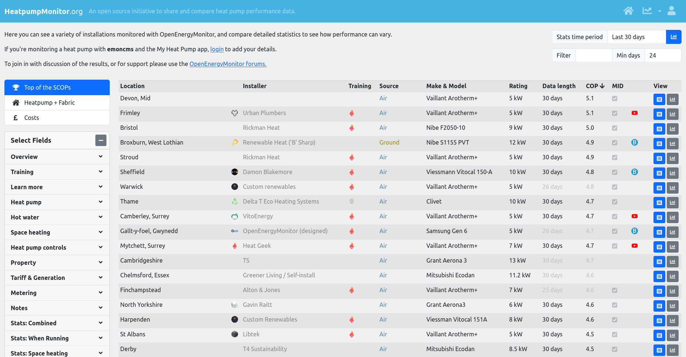

# HeatpumpMonitor.org Introduction

[HeatpumpMonitor.org](https://heatpumpmonitor.org/) is an OpenEnergyMonitor open source community initiative to share and compare heat pump performance data.

As of March 2025 there are over 400 heat pump systems uploading data to the site including systems installed by some of the best heat pump engineers in the UK. A core goal for the site is to discover what the state of the art is in terms of system performance and to highlight that with good system design, installation and commissioning, high performance results are possible.

The site is also a learning resource, with enough real world data across a wide range of systems designs and makes and models of heat pump it's possible to answer questions such as:

- What are the flow temperatures that typically lead to high performance.
- What is the real world range of performance that a particular make/model of heat pump gives?
- How well does a particular heat pump model modulate and cycle in mild conditions.
- What is the real world maximum output of each model under defrost conditions.

For installers and prospective owners the data on HeatpumpMonitor.org is useful for finding out what to expect from a particular make/model of heatpump. Every heatpump is different, some modulate down well while maintaining performance, others appear to struggle more with stability outside of a narrower optimum range. Some heatpumps have controls that that provide very high performance through controlled cycling in mild weather, others seem to take longer to reach a state of efficient running when they start up. This data can both inform design specification for new installations and expectations on existing systems.

## Headline stats

- 417 systems [[1]](https://heatpumpmonitor.org/?period=all&minDays=0&other=1&hpint=1&errors=1)
- 286 full MID [[2]](https://heatpumpmonitor.org/?period=all&minDays=0)
- 89 MID with full year of data (SPF 3.9) [[3]](https://heatpumpmonitor.org/)
- 68 MID air source (SPF H4 4.0) [[4]](https://heatpumpmonitor.org/?filter=query:hp_type:air,boundary:h4)

