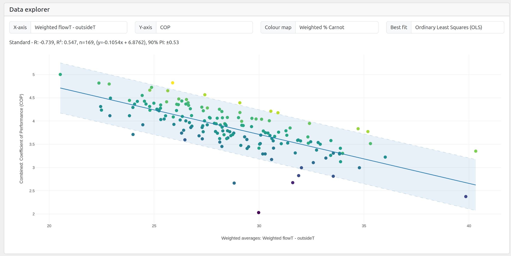
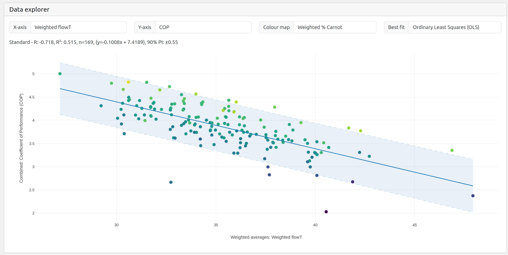
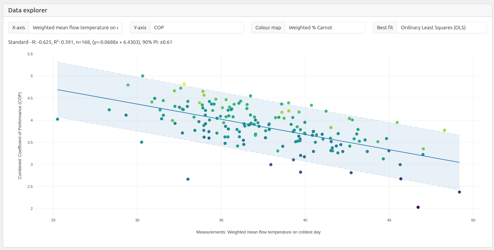
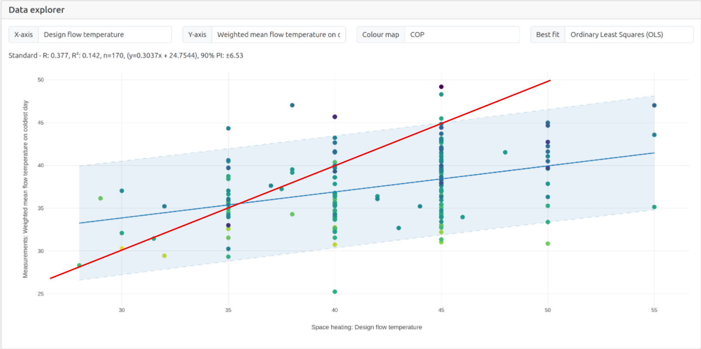
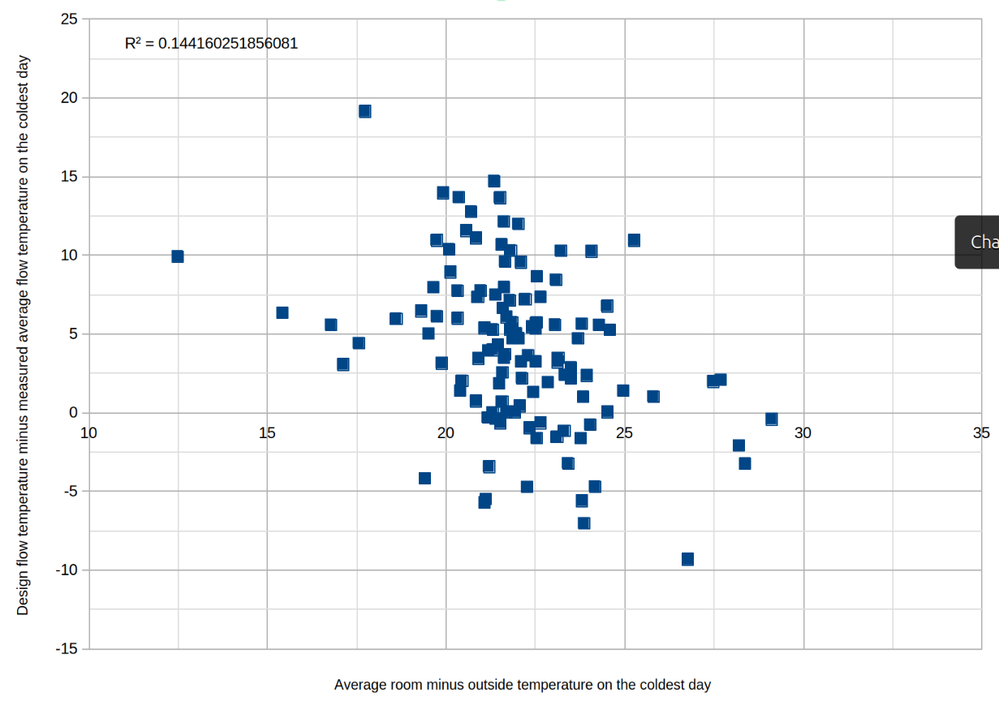

# Low flow temperature = High performance

## Weighted by heat output average flow minus outside temperature

The strongest correlation with performance (R2 0.55) on HeatpumpMonitor.org is weighted by heat output average flow minus outside temperature [[Open chart]](https://heatpumpmonitor.org/?chart=1&filter=query:cooling_heat_kwh:1:lte:t,hp_type:Air:eq:t,boundary:H4:eq:t&period=custom). This is the expected result of course, given the [Carnot COP equation](https://docs.openenergymonitor.org/heatpumps/basics.html#carnot-cop-equation), but it is nice to have the theory confirmed!

*There is clearly a wide range of values above and below the line of best fit and the reasons for this variation is more difficult to pin down. See page about the [practical efficiency factor](prc_carnot) for further discussion.*

Equation of best fit:

    SPF H4 = -0.1054 x Weighted average flowT - outsideT + 6.8762 
    90% PI: ±0.53
    R2: 0.547

Picking out three points as examples, we can see that systems with a weighted average flow minus outside temperature difference of:

- 25 K generally have an SPF H4 of 4.24 ±0.53
- 30 K generally have an SPF H4 of 3.71 ±0.53
- 35 K generally have an SPF H4 of 3.19 ±0.53

Average temperatures over a full year are difficult to relate to practical design directly but are useful as metrics when comparing large numbers systems.

## Weighted by heat output average flow temperature

It is also possible to plot weighted by heat output average flow temperature vs performance directly [[Open chart]](https://heatpumpmonitor.org/?chart=1&filter=query:cooling_heat_kwh:1:lte:t,hp_type:Air:eq:t,boundary:H4:eq:t&period=custom&selected_xaxis=weighted_flowT). While the correlation is slightly less strong (R2 0.52), it is an easier chart to read:

Equation of best fit:

    SPF H4 = -0.1008 x Weighted average flowT + 7.4189 
    90% PI: ±0.55
    R2: 0.515

Picking out three points as examples, we can see that systems with a weighted average flow temperature of:

- 30°C generally have an SPF H4 of 4.4 ±0.55
- 35°C generally have an SPF H4 of 3.9 ±0.55
- 40°C generally have an SPF H4 of 3.4 ±0.55

Again, average temperatures over a full year are difficult to relate to practical design directly but we can see the general picture that most heat needs to be delivered at these relatively low flow temperatures in order to achieve these performance levels. Clearly low design flow temperatures and well tuned weather compensation is required to achieve these averages.

## Good performance = lower average design flow temperatures .. than we think!?

It's also possible to look at the coldest day [[Open chart]](https://heatpumpmonitor.org/?chart=1&filter=query:cooling_heat_kwh:1:lte:t,hp_type:Air:eq:t,boundary:H4:eq:t&period=custom&selected_xaxis=measured_mean_flow_temp_coldest_day), which should if close to design conditions, indicate the flow temperatures that systems actually need to run at during these conditions. These can be compared with expectations from the design calculations.

While the correlation with performance is weaker still (R2 0.4), it is interesting that a lot of the systems that are achieving high performance are running at relatively low flow temperatures when at or close to design conditions.

Inverting this chart to plot SPF on the x-axis and weighted average flow temperature on the coldest day on the y-axis we obtain the following ordinary least squares regression equation:

    Weighted average flow temperature on the coldest day = -5.7x SPF + 59.4
    The 90% Prediction interval at the mean point is: ±5.5

Systems with an **SPF H4 of 4.0** have average flow temperatures on the coldest days of **36.6°C ± 5.5°C**. Systems with an SPF **H4 of 3.5** have average flow temperatures on the coldest days of **39.5°C ± 5.5°C**. These results stand in contrast to the common rule of thumb design flow temperatures of 45°C and 50°C.

It's worth clicking through to a few of these systems to see how they run on the coldest days:  

- **System 68:** 10 kW Viessmann, SPF 5.0, [Average flow temp when running: 33°C (Max: 36°C)](https://emoncms.org/app/view?name=viessmann_combined&readkey=d9fa0b89bb710d76148a53d979624a2f&mode=power&start=1736380800&end=1736467200) *Room temperature 19.0°C (19.4°C in the evening). Outside temperature: -3.2°C. Design flow temperature: 40°C.*

- **System 278:** 10 kW Vaillant, SPF 4.8, [Average flow temp when running: 33°C (Max 35.5C)](https://emoncms.org/app/view?name=MyHeatpump&readkey=5f77aee3a3079c38a1f7e2d4c20d4443&mode=power&start=1736467200&end=1736553600). *Room temperature 19.4°C (20°C in the evening). Outside temperature: -2°C. Design flow temperature: 43°C.*

- **System 53:** 5 kW Vaillant, SPF 4.5, [Average flow temp when running: 31.3°C (Max 36C)](https://emoncms.org/app/view?name=MyHeatpump&readkey=1548bb92f8413211bb7c36cfa154ac94&mode=power&start=1736467200&end=1736553600) *Room temperature 19.8°C (20.8°C in the evening). Outside temperature: -0.6°C. Design flow temperature: 35°C.*

## Calculated design flow temperature vs measured flow temperature on coldest day

Comparing the stated design flow temperature of each system with the actual average flow temperature when running on the coldest day [[Open chart]](https://heatpumpmonitor.org/?chart=1&filter=query:cooling_heat_kwh:1:lte:t,hp_type:Air:eq:t,boundary:H4:eq:t&period=custom&selected_xaxis=flow_temp&selected_yaxis=measured_mean_flow_temp_coldest_day&selected_color=combined_cop), we can see that most systems operate at lower flow temperatures than those calculated in their heat loss design calculations: 

- Systems designed for 35°C are those that run closest to their design temperature.
- Systems designed for 40°C run typically closer ~37.0°C (with wide spread of values).
- Systems designed for 45°C run typically closer ~38.4°C (with wide spread of values).
- Systems designed for 50°C run typically closer ~40.0°C (again with wide spread of values).

A part of this gap, for some systems, between design an measured coldest day mean flow temperature will be due to the measured coldest day not quite matching the design conditions, e.g lower average internal temperature and/or higher average outside temperature. This does not however appear to explain most of the difference.

The following chart shows the measured conditions on the coldest day vs the difference between the design flow temperature and measured flow temperature. The correlation here is very week (R2 0.14) suggesting other factors are more important.

The fact that many systems operate at lower-than-design flow temperatures aligns with our understanding that the assumptions used in heat loss calculations often overestimate heat loss. As a result, after tuning weather compensation settings to reflect actual demand, these systems can run at lower flow temperatures.