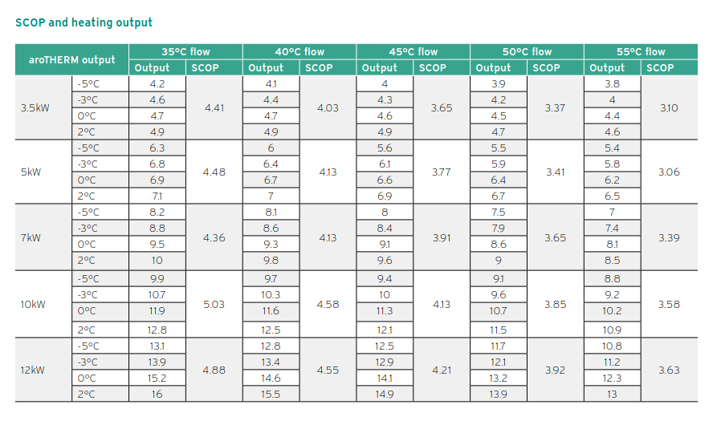
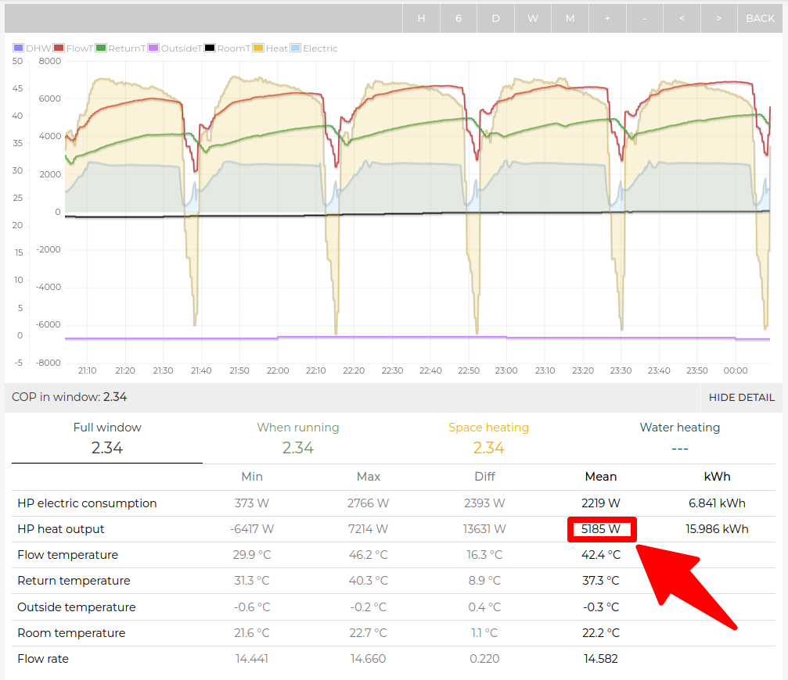
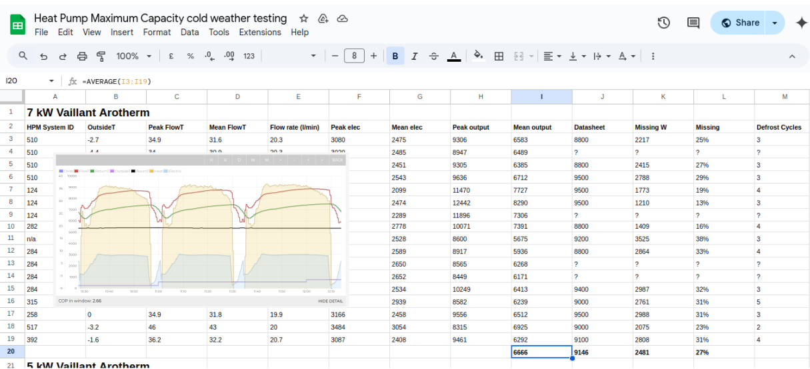
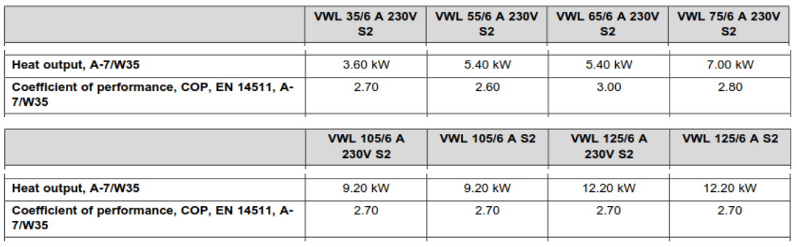

# Max output testing under defrost conditions

The averaged maximum output that a heat pump can sustain over multiple defrost cycles during design conditions is a key piece of information needed when sizing a heat pump. This is particularly the case when an [accurate heat loss assessment](https://docs.openenergymonitor.org/heatpumpmonitor/measured_heat_loss.html#accurate-vs-default-cibse-heat-loss-calculations) is close to this maximum output.

While heat pump manufacturers do provide tables that state maximum outputs alongside a small number of test results that adhere to the EN 14511 standard, there is a lack of clarity about which numbers should be used and if maximum output tables really do cater for real-world defrosting during design conditions.

**The results below suggest that it's wise to add a minimum 20-30% margin factor on top of an accurate heat loss calculation. See pages on [accurate vs CIBSE default heat loss calcs](https://docs.openenergymonitor.org/heatpumpmonitor/measured_heat_loss.html#accurate-vs-default-cibse-heat-loss-calculations) and [over-sizing](https://docs.openenergymonitor.org/heatpumpmonitor/oversizing.html) for more detail on sizing.**

## Vaillant Arotherm+

Vaillant provide the following SCOP and heating output capacity table in their data sheet for the Arotherm+. This suggests that these units are capable of meeting more than their badge capacity in many conditions.

After receiving reports of several systems not meeting their stated heating capacities over multiple defrost cycles, we analyzed data from as many systems as possible. We also conducted controlled tests on specific units to ensure that the units were being driven as hard as possible.

**Example test:** The following test result from a 5kW Arotherm+ over 5 defrost cycles at a flow temperature close to 45°C and outside temperature fractionally below zero is a good example of what we see. To ensure that the unit was pushed as hard as possible the WC curve was set to target 90°C flow temp at 0°C, the connected emitter system is a generously sized open loop radiator system.

The data sheet table suggests that the unit has a heating output capacity of 6.6 kW under these conditions but this test result averaged 5.2 kW (21% less output capacity).

Here's a link to the test data: [Emoncms app view](https://emoncms.org/app/view?name=MyHeatpump&readkey=871ad5efb8f20f698f12d751aea9b8a6&mode=power&start=1732136650&end=1732147740&cool=1).

### Table of HeatpumpMonitor.org test results

The following table details 35 test results across a range of Arotherm unit capacities. These results suggest the following average heating capacities. 

- 4.9 kW from the 5 kW Arotherm+ (~6.5 kW datasheet, 25% lower)
- 6.7 kW from the 7 kW Arotherm+ (~8.6 kW datasheet, 22% lower)
- 9.5 kW from the 10 kW Arotherm+ (11.0 kW datasheet, 14% lower)

 Download table: [https://docs.google.com/spreadsheets/d/1okPmE48lPNG_zzWzvXiiWOMjtkPRiHuV0LniD_4Z-6A/edit?usp=sharing](https://docs.google.com/spreadsheets/d/1okPmE48lPNG_zzWzvXiiWOMjtkPRiHuV0LniD_4Z-6A/edit?usp=sharing
 )

### Vaillant EN14511 Tests

Vaillant provides additional heating output capacities based on specific tests conducted to the EN 14511 standard, detailed toward the bottom of the installation manual. Interestingly, these results align more closely with our own testing. There are however no full-load test results at -3°C or 0°C, which would facilitate a more direct comparison between these results and both our test results and the Vaillant data sheet table above.

 For more detail and discussion about this topic and the tests performed, please see the forum thread here: [Vaillant maximum output capacity testing](https://community.openenergymonitor.org/t/vaillant-maximum-output-capacity-testing/27221)

## 5kW R410a Mitsubishi Ecodan (2015 model)

The following tests were performed on a PUHZ-W50VHA2(-BS) 5kW R410a (2015 model). 

|Outside Temp|Flow temp|Test output|Datasheet|Difference|
|---|---|---|---|---|
|0.8°C|45°C|4.57 kW|4.94 kW|7%|
|-0.3°C|44°C|4.52 kW|4.87 kW|7%|
|-1.5°C|42°C|4.1 kW|4.8 kW|15%|
|-2.1°C|43°C|4.25 kW|4.77 kW|11%|

For full test details, see forum thread here: [5kW R410a Ecodan PUHZ-W50VHA2(-BS)](https://community.openenergymonitor.org/t/5kw-r410a-ecodan-puhz-w50vha2-bs-maximum-output-testing/24874/13).

## 11kW Daikin Altherma

The following tests were performed on the EBLA11D3V3

|Outside Temp|Flow temp|Test output|Datasheet|Difference|
|---|---|---|---|---|
|1.3°C|44°C|9.4 kW|10.95 kW|14%|
|0.6°C|40°C|8.7 kW|10.5 kW|17%|
|0.7°C|40°C|8.7 kW|10.25 kW|15%|
|-5°C|38°C|8.5 kW|9.9 kW|14%|

For full test details, see forum thread here: [ASHP sizing for Freezing Conditions](https://community.openenergymonitor.org/t/ashp-sizing-for-freezing-conditions/24802/93).