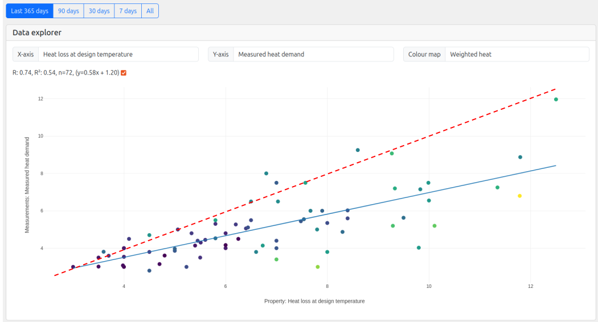

# Heat loss

<!--The first step in designing a heat pump system is to calculate the heat loss of the property. This is done by measuring out building & room dimensions, selecting U-values and ventilation rates, etc that best represent how the building is constructed. This overall heat loss value is used to size the heat pump that is installed and the individual room heat demand requirements coupled with a target design flow temperature determines the size of the emitters.

It is much more common for heat loss calculations to over-estimate rather than under-estimate the heat loss of a property and this can lead to an over-sized heat pump being installed with a modulation range that doesn't match the real world demand of the property well. 

An over-estimated heat loss coupled with the practicalities of finding space for radiators will also tend to push up apparent design flow temperature required for the system.

We can use the monitoring data from HeatpumpMonitor.org to verify how close the in-use measured heat demand of each property is to it's calculated heat loss figure.-->

## Calculated heat loss vs measured heat demand

The following chart plots the pre-installation calculated heat loss with the post-installation measured heat loss for each system: [[Open chart]](https://heatpumpmonitor.org/?chart=1&selected_xaxis=heat_loss&selected_yaxis=measured_heat_loss&selected_color=weighted_heat)

In a similar result to the chart on [calculated vs measured design flow temperature](low_temperature), we see again here that measured heat loss is lower in practice than the calculated design heat loss for most systems.

To give a couple of examples that center on the line of best fit:

- 5.6 kW calculated heat loss = 4.5 kW measured heat loss (20% lower)
- 7.5 kW calculated heat loss = 5.6 kW measured heat loss (25% lower)
- 10 kW calculated heat loss = 7.0 kW measured heat loss (30% lower)

Many of the systems on HeatpumpMonitor.org use more accurate assumptions in their heat loss calculations such as lower air change rates. Some systems will have also had their calculated heat loss assumptions updated to produce a value that better matches the measured value (likely the few systems that track the red line). It's expected that the overall gap here is lower than in the wider industry.

We do however see plenty of examples with greater differences, e.g a 10 kW Grant with a 6.6 kW calculated heat loss and 3.8 kW measured heat loss. This heat pump is 2.6x larger than the measured heat loss, a result that is not unusual.

**The general result from the above chart is consistent with our understanding of how the assumptions used in heat loss calculations tend to over-inflate heat loss.**

## HeatpumpMonitor.org heat demand tool

*Note: Unlike the flow temperature comparison the measured heat demand values used in the chart above have been extrapolated to design conditions (where design conditions have not been met). This is done using the HeatpumpMonitor.org measured heat demand tool.*

A couple of examples of how this tool works can be found here:

- System 68: 10kW Viessmann Vitocal, 7.2 kW calculated heat loss, 5.4 kW measured heat demand: [https://heatpumpmonitor.org/heatloss?id=68](https://heatpumpmonitor.org/heatloss?id=68)
- System 278: 10 kW Vaillant, 7.5 kW calculated heat loss, 7.0 kW measured heat demand: [https://heatpumpmonitor.org/heatloss?id=278](https://heatpumpmonitor.org/heatloss?id=278)

Here's a screenshot from the Viessmann Vitocal:

*The precision of the measured heat loss value is typically +-15%.*

## Accurate vs default DHDG heat loss calculations
It's worth clarifying how certain assumptions used in heat loss calculations can lead to inaccurate results and define what we mean by an **accurate heat loss calculation** vs a **by-the-book default CIBSE Domestic Heating Design Guide heat loss calculation**. Understanding the difference between these is key to both setting weather compensation well and sizing the heat pump itself, avoiding over-sizing while ensuring there is enough margin to cover defrost conditions.

- **An accurate heat loss calculation:**  is a heat loss calculation that matches measured heat demand under design conditions to within say +-15%. This is typically an averaged heat demand over a 24 hour period.

- **A by-the-book domestic heating design guide heat loss calculation:** is a heat loss calculation that is based on default assumptions in the CIBSE domestic heating design guide. This can result in heat loss results that are at worst 2.5x over-estimated (solid stone pre-2000 mid-terrace) but are more usually 1.5-1.8x in properties built before the year 2000 ([93% of UK housing stock](https://en.wikipedia.org/wiki/Housing_in_the_United_Kingdom)).

The main factors that contribute to differences between heat loss calculations and measured demand are:

- Air change rates (e.g Pre-2000 & 2006 design guide)
- U-values (e.g solid stone, brick and window U-values can often be lower than CIBSE defaults)
- Design outside temperatures (actual 99.6% design temperature can often be higher than default tables).
- Semi-detached/terraced assumptions about neighbor temperatures. It is of course good to have contingency to cover periods with neighbors unoccupied but this can be a source of the difference).

In order to explore the difference these assumptions can make, we have created a simple heat loss tool that compares more accurate assumptions with the CIBSE defaults. This tool is available here: [https://openenergymonitor.org/tools/SimpleHeatLoss](https://openenergymonitor.org/tools/SimpleHeatLoss). 

While using this tool, notice how an over-estimated heat loss suggests that a lot more radiators are required to run at lower flow temperatures than a more accurate heat loss calculation. **Over-inflated heat loss calculations confuse our expectations for the flow temperatures needed.**

The industry is moving in the direction of improving the accuracy of heat loss calculations:

**New MCS heat load calculator** 
Up until December 2024 the Excel MCS heat loss calculator also used the calculation method from the Domestic Heating Design Guide but this has now been replaced with a new online heat load calculator that implements the full EN12831 ventilation heat loss calculation. [This effectively halves ventilation heat loss in pre-2000 naturally ventilated buildings, 1.7 ACH becomes around 0.8 ACH](https://docs.openenergymonitor.org/heatpumps/air_change_rate_calculations.html#en12831-2017). This EN12831 compliant calculation is not widely used in other domestic heat loss tools at the time of writing.

## Accurate heat loss risks

While improving the accuracy of heat loss calculations is a worthwhile goal and should help both improve the sizing of systems and make it easier to set more optimal weather compensation settings. There are also a couple of risks associated with improving heat loss accuracy that could cause performance to go down rather than up if not carefully considered:

**1\. Smaller radiators/emitters if design flow temperatures are not reduced:**
If you have a design process where you always target a specific design flow temperature e.g 50C (Common amongst some of the larger installation companies). Switching from pre-2000 air change rates to say 0.5 ACH will result in a lower heat loss which is fine, but then crucially the specified radiator sizes will be less. This system will then have to run at 50C in practice and will not have the opportunity for performance improvement by dropping the weather compensation curve. **Recommendation: If previously designing to 45 or 50C drop design flow temperature to e.g a default of 40C when more accurate assumptions are used (with flexibility to increase of course depending on space, customer requirements etc).**

**2\. Maximum output capacity data during defrost conditions cant always be relied upon**.
The issue of over-inflated heat loss calculations has also largely hidden an issue with heat pump max output capacity data during defrost conditions in the UK. Some units are capable of less sustained output during defrost conditions than is stated on their data-sheets. The danger here is that as we get closer to actual heat demand in our heat loss calculations being able to rely on manufacturer data for maximum outputs becomes much more important. If the actual output is lower customers with a finely matched heat pump might find themselves short of heat on the coldest days even through the calculations and design on paper suggest everything should be fine.