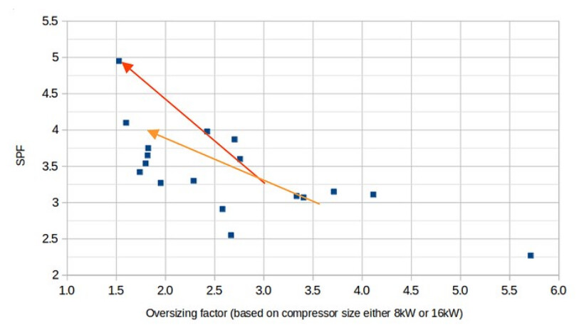

# Over-sizing

Over-sizing seems to be mostly an issue when over-sizing the heat pump unit on top of an over-estimated heat loss calculation. Where the size of the heat pump is 2-3x larger than the actual heat demand.

Conversely adding a fairly significant margin on top of an [accurate heat loss calculation](https://docs.openenergymonitor.org/heatpumpmonitor/measured_heat_loss.html#accurate-vs-default-cibse-heat-loss-calculations) may actually be a good thing. Some of the highest performing systems on HeatpumpMonitor.org have a significant margin on top of their measured heat demand.

**Important:** This measured heat demand is often significantly lower than the pre-installation calculated heat demand, be careful not to add such a significant margin on top of an over-estimated heat loss, see the page on [measured heat loss here](measured_heat_loss).

- System 68, 10 kW Viessmann  5.4 kW heat demand, SPF H4 5.0 (80% margin on top of the measured heat loss, 35% margin on top of the pre-installation calculated heat loss.) [[13]](https://heatpumpmonitor.org/heatloss?id=68).

- System 278, 10 kW Vaillant, 7.0 kW heat demand, SPF H4 4.8 (35-40% margin on top of the measured heat loss, -15% margin on pre-2000 CIBSE assumptions = 11.7 kW) [[14]](https://heatpumpmonitor.org/heatloss?id=278).

There are also plenty of 5 kW units on the site that are delivering SPF’s around 4.5 with a real world measured heat loss of 3.5 kW (40% margin).

## Over-sizing factor vs performance: Vaillant Arotherm+

Plotting over-sizing factor based on measured heat loss vs performance for Vaillant Arotherm+ units, we don't see a strong relationship at least in the 0.9 to 1.6x range. We see an example of top end performance at 1.6x (system 139, 5kW Arotherm+) *This is not to say there isn't a relationship, plotting over-sizing against performance like this can give a misleading impression given that performance is dependent on a much greater range of factors (see next example looking at Daikin units).* [[Open chart]](https://heatpumpmonitor.org/?filter=vaillant&chart=1&selected_xaxis=oversizing_factor&selected_color=weighted_flowT)

## Over-sizing factor vs performance: Daikin Altherma

When we plot badge capacity based over-sizing factor against performance for Daikin units, this chart does not at first suggest a strong relationship [[Open chart]](https://heatpumpmonitor.org/?filter=daikin&chart=1&selected_xaxis=oversizing_factor&selected_color=weighted_flowT&hpint=1&other=1&minDays=280):

This does not however reflect the real world experience on the OpenEnergyMonitor forum for the potential performance improvement from right-sizing a Daikin Altherma unit, see thread [https://community.openenergymonitor.org/t/is-an-oversized-daikin-really-a-problem/26930/17](https://community.openenergymonitor.org/t/is-an-oversized-daikin-really-a-problem/26930/17).

The following chart shows the very substantial performance improvement seen when two large 9-11 kW Altherma units were swapped out for 8kW units that better matched heat demand. Performance went up by a whole +1 SPF.

This highlights a limitation of de-rated heat pump models. The 9 kW Daikin Altherma uses the same compressor as the 16 kW unit, resulting in a relatively high minimum modulation level. 

**Example:** While the 9 kW model appears to have an oversizing factor of 1.5x—50% above a real-world heat demand of 6 kW—the de-rated 16 kW compressor effectively increases this to a 2.7x oversizing factor.

Notice the much wider X-axis range on the following chart of over-sizing factor based on the compressor size vs performance:

