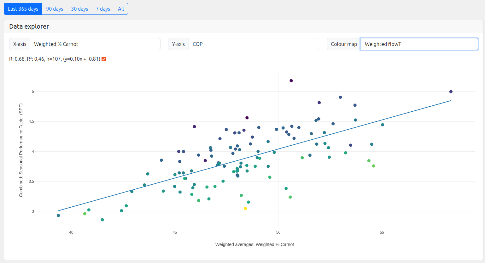

# % of ideal Carnot COP

Another strong but less straightforward correlation with performance is the practical efficiency factor, also known as the percentage of the ideal Carnot COP.

This factor could be seen as a measure for the remaining variation in performance once we control for flow and outside temperature.

The carnot COP equation states that the ideal performance of a heat pump is governed solely by the condensing and the evaporating temperature.

    Carnot_COP = (T_condensing + 273) / ((T_condensing+273) – (T_evaporating + 273))

In practice, real world heat pumps do not achieve this ideal efficiency and so we have to multiply the ideal efficiency with a *Practical efficiency factor*. This is usually suggested to be around 0.5 or 50%.

    Practical_COP = Practical efficiency factor x Carnot_COP

The following chart shows the weighted by heat output % of ideal carnot COP for each system on HeatpumpMonitor.org compared to it's seasonal performance factor (SPF). The interesting result here is both the relatively high correlation factor and the wide range of results. Most systems sit between 45% and 55%, this might seem like a small range but the effect is significant.

**Chart:** % of ideal carnot COP vs Performance [[Open Chart]](https://heatpumpmonitor.org/?chart=1&selected_xaxis=weighted_prc_carnot&selected_color=weighted_flowT&filter=query:hp_type:air&minDays=290).

To illustrate the impact this factor can have, take the following example of a well designed heat pump system running at a 33°C flow temperature at a typical January outside temperature of 6°C. *(We will assume that the condensing temperature is 2°K above the flow temperature and the evaporator temperature is -6°K below the outside temperature).*

|Flow temp|Outside temp|% Carnot|Ideal COP|Practical COP|
|---|---|---|---|---|
|35°C|6°C|40%|8.4|3.35|
|35°C|6°C|45%|8.4|3.77|
|35°C|6°C|50%|8.4|4.19|
|35°C|6°C|55%|8.4|4.61|

As we can see, a system operating at 55% of the ideal Carnot COP will achieve significantly better performance at the same system temperatures than one operating at 45% of the ideal Carnot COP. 

## Causes for % carnot range?

- The **quality of heat pump** could be one factor, but then we see a large range of % carnot from the same heat pump models:
    - Viessmann: 45% to 58%
    - Vaillant: 41% to 54%
    - Samsung: 41% to 50%
    - Mitsubushi: 39% to 56%

- **Primary pipework length** before the heat meter can have a strong effect, that we have been able to quantify e.g [https://community.openenergymonitor.org/t/how-long-primary-pipework-can-drop-hot-water-cops-from-4-to-3/26708](https://community.openenergymonitor.org/t/how-long-primary-pipework-can-drop-hot-water-cops-from-4-to-3/26708).

- **Heat meter inaccuracies:** sensor placements & water quality etc is a likely contributor. The error margin of ~3% that we saw from our own testing is only enough to account for about one tenth of the typical range in % of ideal Carnot [https://community.openenergymonitor.org/t/heat-meter-accuracy-testing/27306](https://community.openenergymonitor.org/t/heat-meter-accuracy-testing/27306). It is likely that greater metering errors are happening in the field, the maximum permissible error (MPE) on a heat meter of 7% could account for one third of the % carnot range.

- **Control issues** e.g rapid cycling on some models, heat pump never gets to efficient operating regime.

- **Effects resulting from distortion**, some systems with poor balancing appear to give an issue here but needs more investigation.

- **Refrigerant cycle** / quality control, e.g under charged systems, other defects.

Understanding and quantifying these factors is a key part of understanding the remaining variation in system performance beyond basic system flow and outside temperature variation.