# Air change rate calculation methods

## Default values from the CIBSE Domestic Heating Design Guide

Most standard heat loss calculators do not provide a method for deriving room air change rate values from other inputs such as a blower door test or building fabric details as is common in whole house calculators such as SAP 2012. Typically, there is a selection for the age of the property, which is then used to apply default air change rate values from the [CIBSE Domestic Heating Design Guide](https://www.cibse.org/knowledge-research/knowledge-portal/domestic-heating-design-guide-2021).

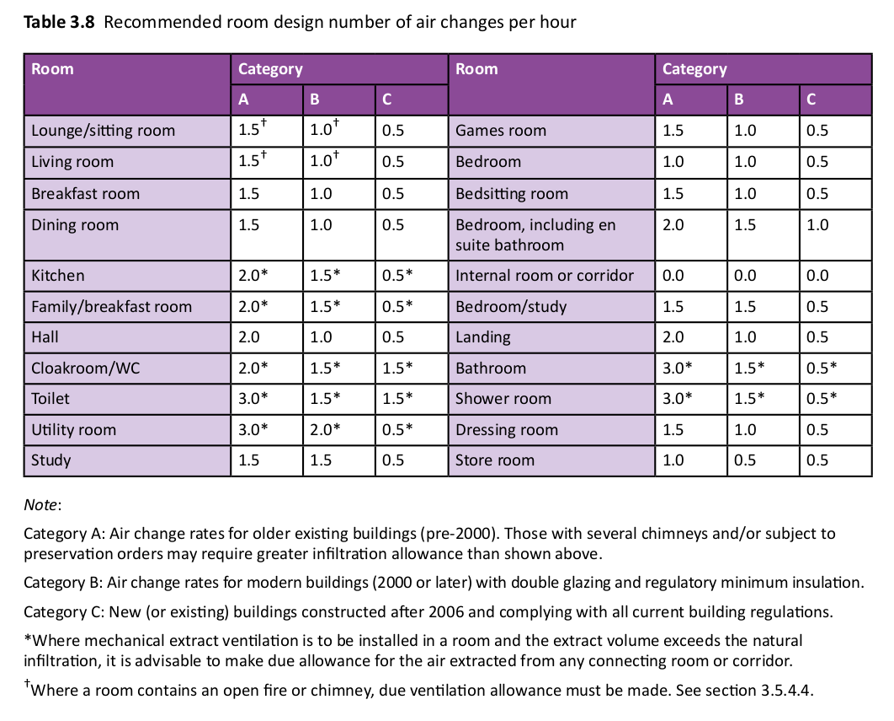

**These defaults, especially the values for category A (pre-2000 older buildings), lead to a significant overestimation of ventilation heat loss in most houses.** Considering that 93% of the UK housing stock was built before 2000 (Wikipedia: [Housing in the United Kingdom](https://en.wikipedia.org/wiki/Housing_in_the_United_Kingdom)), this poses a substantial challenge for accurate heat loss calculation.

**These defaults can usually be overridden**, and many heat pump installers are applying more realistic air change rate values based on experience and engineering judgment. However, the lack of clear evidence-based guidance from CIBSE in the design guide remains an issue, as not all installers are comfortable deviating from these default values.

## MCS Guidance

The MCS [MIS-3005-D](https://mcscertified.com/wp-content/uploads/2021/12/MIS-3005-D-Heat-Pump-Design-Issue-1.0.pdf) standard does not specifically address ventilation and air change rates. It is important to note the terms must, shall, should, each of which has a specific meaning in the MCS standard document to clarify what is and is not a compliance requirement.

The guidance given in the [MCS ‘Domestic Heat Pumps: A best practice guide](https://mcscertified.com/wp-content/uploads/2021/10/Heat-Pump-Guide.pdf) provides useful and sensible guidance:

1.  Older houses with basic additions such as double glazing and doors with rubber gaskets may not reflect age based air change rates.

2. Individual rooms such as the bathroom and kitchen's do not have to to use high air change rates with outside air, given that higher ventilation requirements will draw air at least partially from adjoining areas. The more comprehensive ventilation calculation method in the EN 12831 standard referenced by MCS provides equations that take into account how air is drawn from adjoining areas.

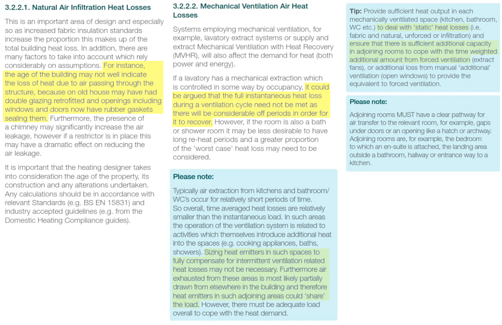

Up until December 2024, MCS provided an Excel based heat loss calculator (We have saved a copy of it here: [MCS-Heat-Pump-Calculator-Version-1.10-locked.xlsm](MCS-Heat-Pump-Calculator-Version-1.10-locked.xlsm)) It both references the CIBSE Domestic Heating Design Guide air change rate table directly and uses the simplified calculation approach documented in that guide. This is perhaps the main reason these values and the simplified calculation are still used in heat loss tools to this day.

**In December 2024, MCS published a [new online heat load calculator](https://mcscertified.com/heat-load-calculator/)** that is unfortunately only accessible to registered MCS installers. This tool implements the ventilation calculation from the EN12831 standard which effectively halves ventilation losses for pre-2000 naturally ventilated buildings. 

The following examines the EN12831 standard and alternative approaches to calculating air change rate values, including Part F regulations, SAP2012, and the newer Home Energy Model calculation method. Arguably, air change rates should be an output rather than an input in ventilation calculations, and these approaches provide useful examples of how to do this.

## EN12831:2017

The MCS heat pump standard states that heat loss calculations *shall* be done in accordance with EN 12831:2017. Crucially this standard details both a simplified and a more comprehensive 'standard' calculation method. It is worthwhile reading if you want a deeper understanding of this often referenced document. 

**Tip:** Given the importance of this standard it should arguably be provided free of charge by MCS or another suitable body. It is however possible to buy the standard for a more reasonable amount from the [Estonian Centre for Standardisation and Accreditation](https://www.evs.ee/en/evs-en-12831-1-2017).

The MCS heat pump calculator implements most of the simplified calculation method - but seems to miss out a significant factor (fi-z)that halves ventilation heat loss  when individual rooms are summed together to give the ventilation heat loss for the whole dwelling. 

**Simplified calculation method** 
The main equations for the simplified method are given in 6.3.3.2.2. Notice how qv,min,i is multiplied by fi-z in equation 13 but not in equation 14.

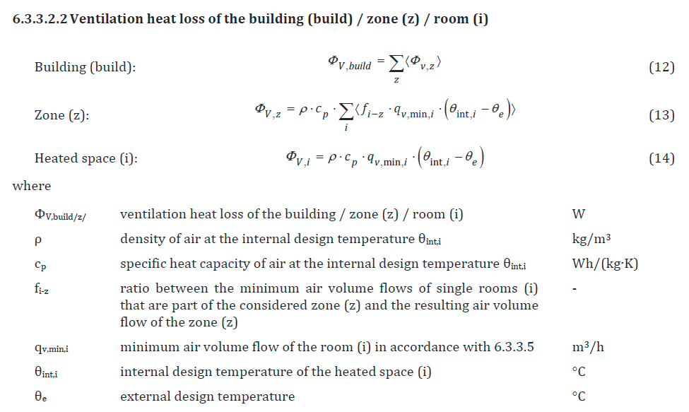

Default values for factor fi-z is given in table B.2.9 and appears to be 0.5 in all cases where there is more than 1 room in the zone:

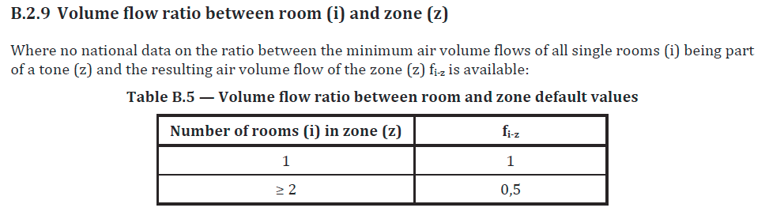

A zone is defined as a group of rooms that are air-connected by design. The shortened door leaf sounds like the undercut required for part F *("From part F: 3.27 Internal doors should allow air to move within the dwelling by providing a free area equivalent to a 10mm undercut in a 760mm wide door")*.

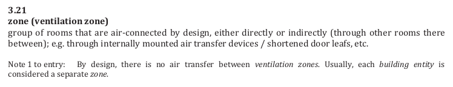

An example of this simplified calculation and fi-z factor in action can be found in the supplementary EN12831-2. Notice again how individual room heat losses are halved when summed as a zone.

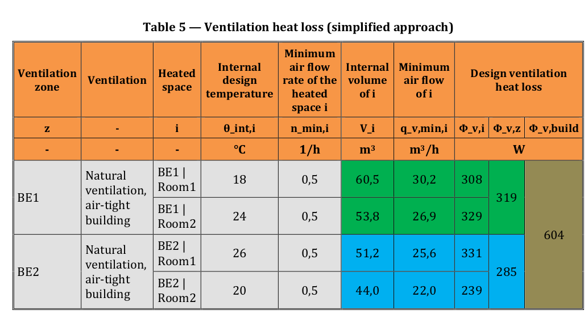

**Standard calculation method**  
The final equations for the standard calculation method are given in section 6.3.3.3.1, equations 15, 16 and 17. Notice again the factor fi-z. The implementation is slightly different here, when calculating ventilation heat loss for a room in equation 17, there is a selection for qv,env,i,  this is replaced with qv,leak+ATD,i in equation 16.

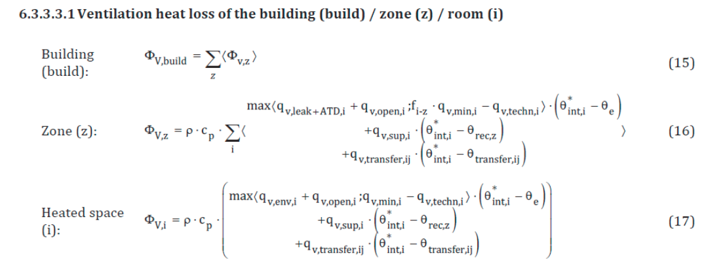

- qv,env,i is the external air volume flow into the room through the building envelope.

 - qv,leak+ATD,i is the external air volume flow into the room through leakages and ATDs (air terminal devices).

Reading the full standard is required to understand the detail here, this description is not meant to be a substitute. Rather, it aims to provide a set of pointers on what to watch for.

One of the things to notice is that the calculation for qv,env,i includes an orientation factor fdir that doubles the infiltration air volume rate. Skipping qv,env,i  and using qv,leak+ATD,i directly later in naturally ventilated zones halves the ventilation heat loss with the same effect as the fi-z factor.

The exact reasons for these factors are not clearly articulated in the standard. A logical explanation could be that under wind load, rooms facing the wind might have cold air pushed into them. This air would then move, pre-warmed, to adjoining rooms on the other side of the building, resulting in higher heating requirements for wind-facing rooms than those on the leeward side. The latter halving likely reflects an averaging out of these effects across the entire building.

*We would welcome peer review of these points. This interpretation is based on our understanding of the standard, and it would be beneficial to have it confirmed by others.*

**Example spreadsheet calculation using the EN12831-1:2017 standard method**

The following spreadsheet example implement the standard method as closely as possible. Please check these calculations and use with caution.

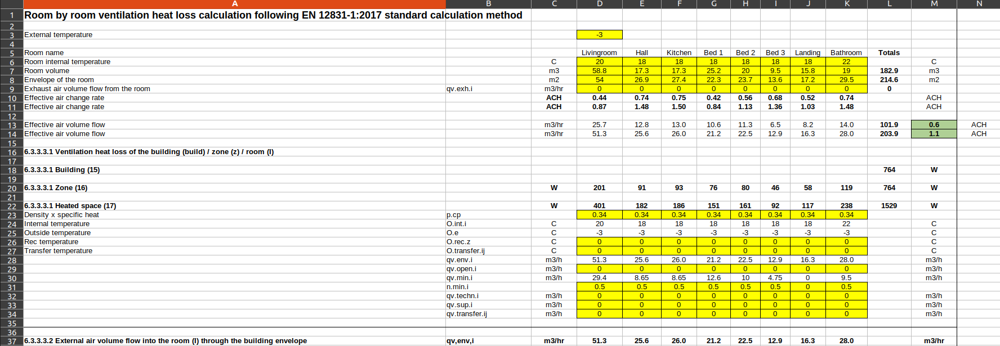

**Download:** [EN12831_2017_ventilation_calculation.ods](img/EN12831_2017_ventilation_calculation.ods)

The example given is of Trystan Lea's mid-terrace solid stone house. It uses the measured blower door test air permeability result of 8.9 m3/h/m2 (corrected up to 9.5 m3/h/m2 as blower door test noted envelope area must have used external dimensions). This is the result **without** taping up the extract vents and the stove. Assuming natural ventilation it suggest a whole house air change rate of 0.6 ACH (with individual rooms at 1.1 ACH). This whole house air change rate agrees well with CO2 monitoring derived results and coincidentally the part F minimum.

## Part F regulations

[Part F of the building regulations](https://www.gov.uk/government/publications/ventilation-approved-document-f) addresses ventilation and improving air quality inside buildings. **Section 1.24** specifies minimum whole dwelling ventilation rates. These values are coincidentally quite close to measured ventilation rates in pre-2000 buildings with natural ventilation and/or intermittent extraction. 

**Example calculation**

A two story 3 bed house with a floor area of 77m2 and ceiling heights of 2.4m has an internal volume of 185 m3.

a) The minimum of 0.3 litres per second per m2 of internal floor area results in this case to:

    0.3 L/s x 77 m2 = 23.1 L/s
    23 L/s × 3600s/hr × 0.001  m3/L = 83.2 m3/hr
    83.2 m3/hr / 185 m3 = 0.45 air changes per hour (ACH)

b) The minimum rate determined by the number of bedrooms is higher at 31 L/s:

    31 L/s × 3600s/hr × 0.001  m3/L = 111.6 m3/hr
    111.6 m3/hr / 185 m3 = 0.6 air changes per hour (ACH)

This gives us a useful guide for minimum ventilation rates from an air quality perspective which is an important factor for whole house system design.

Part F building regulations also stipulate minimum ventilation rates for intermittent and continuous extract ventilation. Except for intermittent extraction in kitchens without cooker hoods, these rates are typically lower than the whole-house ventilation rate.

Ideally, ventilation for air quality should be demand-led. An airtight building with controlled ventilation, when actively used and understood by occupants, will provide better air quality and more control over ventilation heat loss compared to buildings that rely on natural ventilation. The latter may under-ventilate in calm weather and over-ventilate in very windy conditions.

## SAP 2012

The infiltration and ventilation calculation in [SAP 2012](https://bregroup.com/expertise/energy/sap/standard-assessment-procedure-2012) provides a method to estimate air change rates using either basic details about the dwelling or results from a blower door air permeability test. Over ten years ago, we developed a tool in collaboration with CarbonCoop, based on the SAP model, named MyHomeEnergyPlanner. Below is a screenshot of the ventilation section from our more recent minimal implementation, SAPjs:

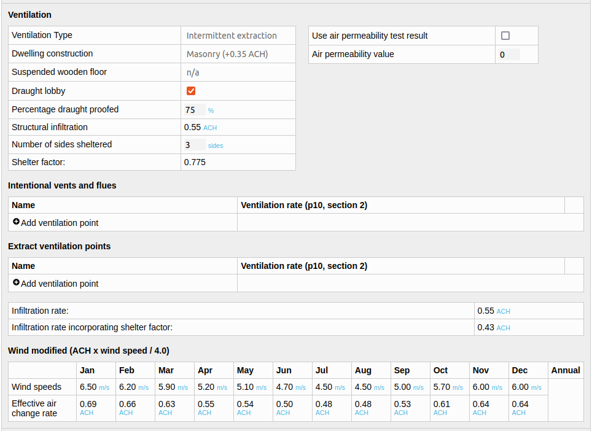

**Try the tool here:** [https://openenergymonitor.org/sapjs/](https://openenergymonitor.org/sapjs/)

**SAPjs source code:** [https://github.com/TrystanLea/SAPjs/](https://github.com/TrystanLea/SAPjs/)

**OpenBEM underlying model code:** [https://github.com/TrystanLea/openBem](https://github.com/TrystanLea/openBem)

The SAP 2012 calculations are split into infiltration (air movement through the building structure) and ventilation.

The following table summarises the factors that are used to calculate the basic structural infiltration rate. 
These are summed together, multiplied by a shelter factor and then a wind speed factor to give the final result.

| Property | Impact (ACH) |
| ---- | ---- |
| Number of floors (n) | (n-1) &times; 0.1 | 
| Timber frame | +0.25 |
| Masonry | +0.35 |
| Suspended wooden floor (unsealed) | +0.2 |
| Suspended wooden floor (sealed) | +0.1 |
| No draught lobby | + 0.05 |
| Draught proofing | + 0.25 - (0.2 &times; % draught proofed) |

A 2 story house, masonry, solid floor, with draught lobby, 75% draught proofed:

    0.1 (floors) + 0.35 (construction) + 0.25 - (0.2 x 0.75) = 0.55 ACH
    
Next it applies a shelter factor (assuming 3 sides sheltered in this example):

    shelter_factor = 1 - (0.075 x number of sides sheltered);
    infiltration after shelter factor = infiltration x shelter_factor

    shelter_factor = 1 - (0.075 x 3 sides) = 0.775
    infiltration after shelter factor = 0.55 ACH x 0.775 = 0.43 ACH

Then the wind factor (example 6.5 m/s):
        
    windfactor = windspeed / 4
    infiltration = infiltration x windfactor

    windfactor = 6.5 m/s / 4 = 1.625
    infiltration after wind factor = 0.43 ACH x 1.625 = 0.69 ACH

### From air permeability test

The model also allows for the use of an air permeability test result directly. Here is an example of using the mid terrace house blower door test result above of 8.9 m3/hr/m2.

This gets converted to air changes per hour at 50pa by multiplying by the external envelope area and dividing by  the dwelling volume:

    8.9 x 240.2 m2 / 205.8 m3 = 10.4 ACH @ 50pa

The divide by 20 approximation is then applied:

    10.4 / 20 = 0.52 ACH

The calculation then returns to the shelter factor and wind factor steps above:

    0.52 ACH x 0.775 (3 sides sheltered) = 0.403 ACH
    0.403 ACH x 6.5 m/s / 4 = 0.65 ACH

Both results are similar and also close enough to the  CO2 monitoring derived result of 0.6 +- 0.2 ACH, part F minimum ventilation rate and EN 12831 derived values.

### Wind speed correction

Here's the wind speed and temperature for the example house in January, there is a rough correlation between wind speed and outside temperature, milder weather generally brings higher winds, convenient for heat loss (but less convenient for wind generation when you need it).   

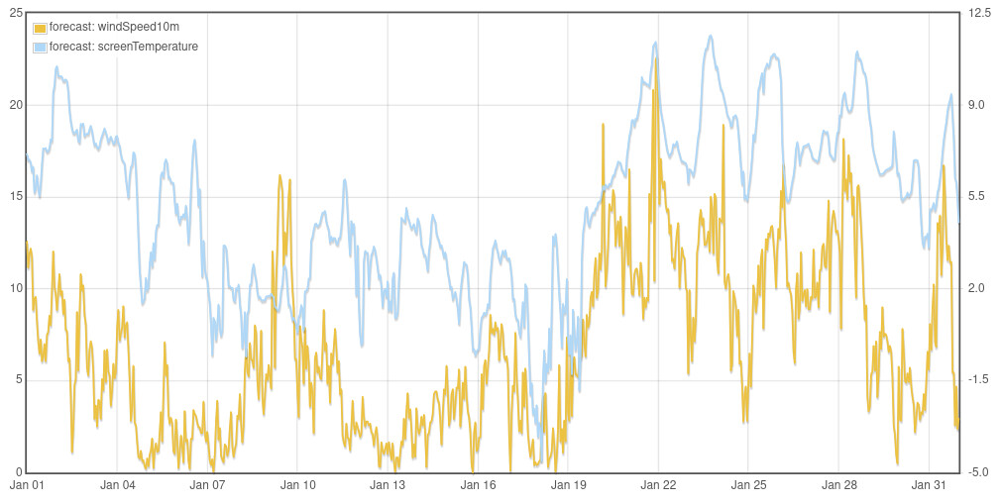

Correlation (each datapoint is an hour):

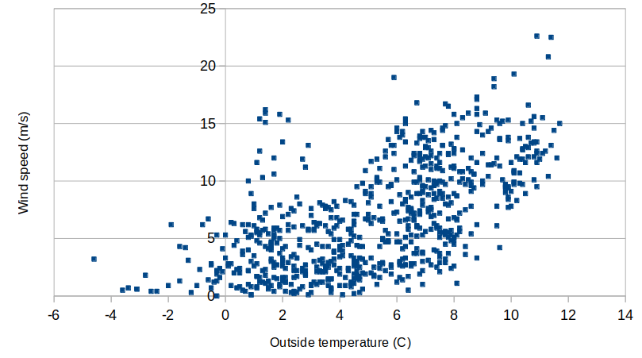

The simple SAP wind speed factor appears to yield reasonable results. During the storm from January 20th to 24th, when wind speeds were approximately 12.5 m/s, this results in a multiplication factor of 3.1x (12.5/4). Applying this to the base blower door rate of 0.403 ACH results in 1.26 ACH. CO2 monitoring during this period measured an average of 1.2 ACH, a close agreement!

## Home Energy Model

The SAP replacement ([Home Energy Model](https://www.gov.uk/government/publications/home-energy-model-technical-documentation)) has a very similar calculation. One of the main differences is the divisor table, which gives different factors to divide the n50 value, other than divide by 20.

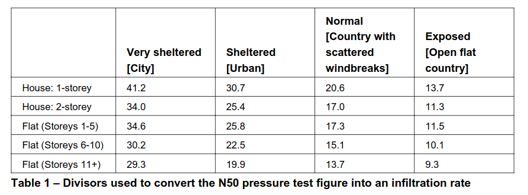

The shelter factor equation and the wind factor equations as used in SAP 2012 are the same but the result from the mid terrace example house would go up slightly if the *Normal (Country with scattered wind breaks)* divisor is used to around 0.74 ACH.

## Summary

All four calculation approaches (Part F, EN 12831, SAP 2012 & HEM) provide whole house air change rate values for the example house that agree well with CO2 monitoring results and real world monitored heat loss. This helps provide a stronger case and calculation approach when deviating from the CIBSE pre-2000 default values.

