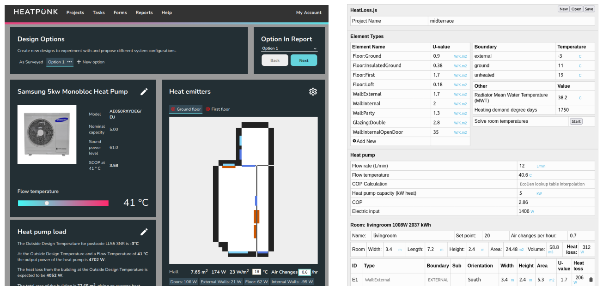
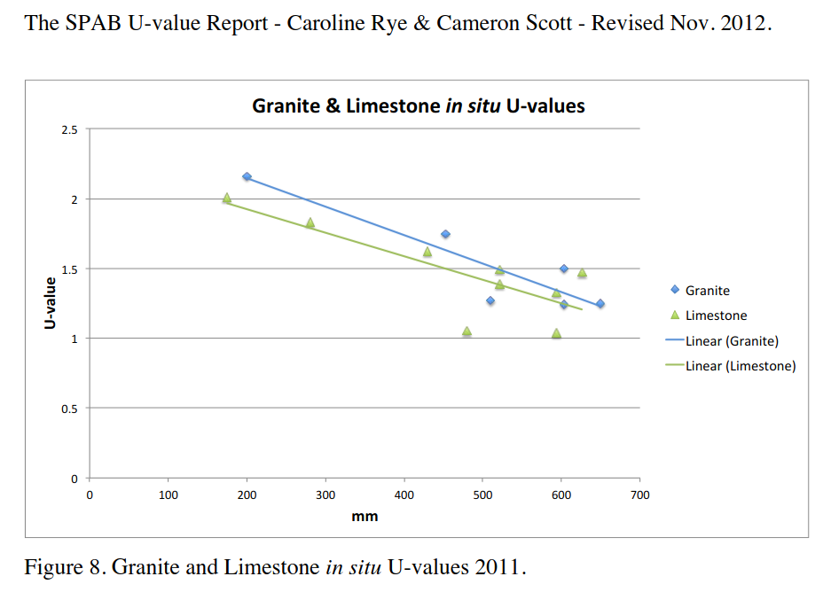
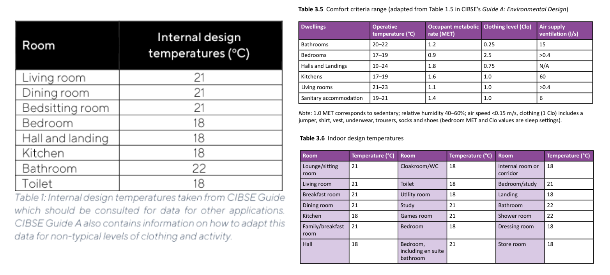
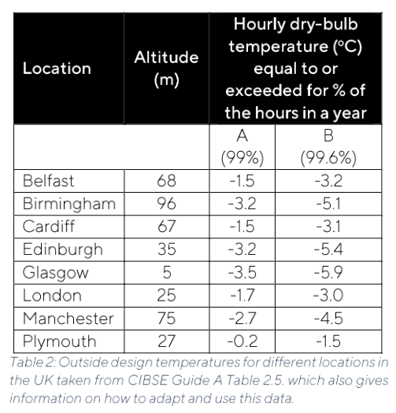
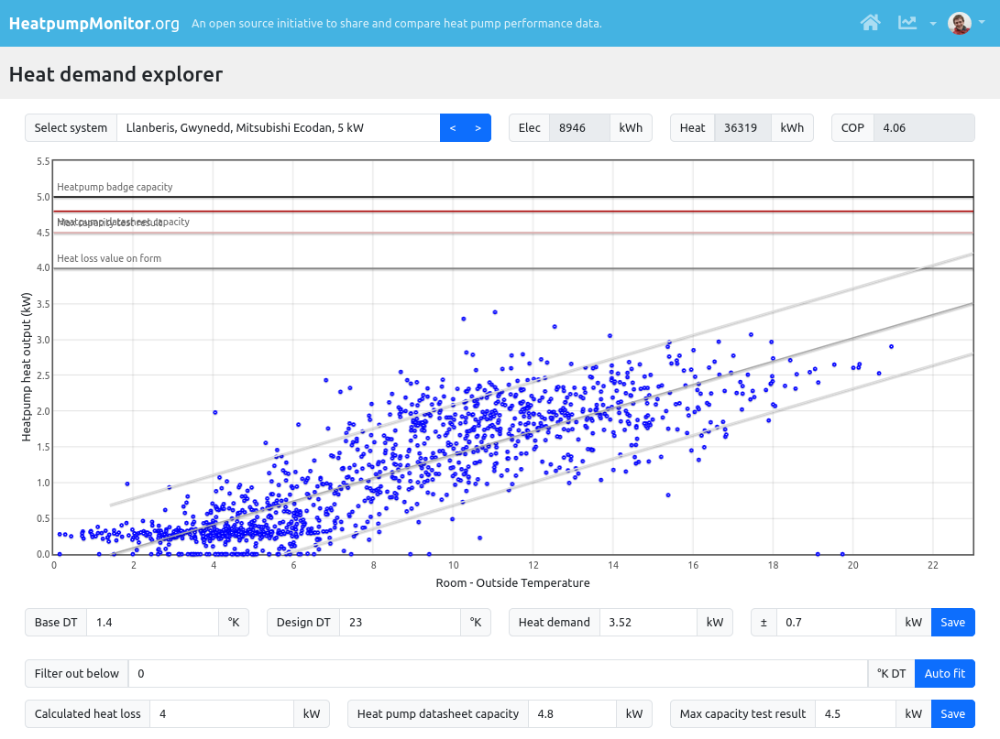

# Heat loss calculation

*Updated: Mar 2025, adapted from [https://trystanlea.org.uk/roombyroomheatloss](https://trystanlea.org.uk/roombyroomheatloss)*

The first step in designing any heat pump system is to perform a heat loss calculation. This calculation estimates the amount of heat a house needs to reach a target internal temperature when it is very cold outside. It is also used to size radiators or underfloor heating to ensure that each room receives the appropriate amount of heat.

The results of a heat loss calculation are only as good as the assumptions that go into it. While it is relatively easy to accurately measure room dimensions, other assumptions, such as air change rates and fabric U-values, are more challenging to get right. The current CIBSE guidance for pre-2000 air change rates, in particular, results in widespread overestimates of building heat loss and, consequently, oversizing of the resulting heating system.

There are a large number of good heat loss calculation tools. One of the easiest free tools is [https://heatpunk.co.uk](https://heatpunk.co.uk) by Midsummer. We have also developed our own open source tool called [HeatLoss.js](https://openenergymonitor.org/heatlossjs) and while it has some advanced features, it is certainly harder to enter in all the building dimensions.

**Left: HeatPunk by Midsummer. Right: HeatLoss.js by OpenEnergyMonitor.**

The following guide walks through some of the main factors to consider when carrying out a heat loss calculation and gives an example of calculating the heat loss for a mid-terrace solid stone house. [System 2 on HeatpumpMonitor.org](https://heatpumpmonitor.org/system/view?id=2). This example illustrates how default assumptions can over-estimate heat loss and how to perform a more accurate calculation.

## Heat Loss Calculation Steps:

## 1\. What is the house made of?

Tools typically start by defining a list of the materials and associated U-values for the different building elements: external walls, internal walls, ground floor, intermediate floors, loft/roof, windows, and doors. MCS provides a guidance document on U-values, which offers a useful starting point; see: [Guidance on U-values from Domestic Heating Design Guide](https://mcscertified.com/wp-content/uploads/2020/04/Guidance-on-U-Values-from-Domestic-Heating-Design-Guide.pdf). 

It is worthwhile to search for the latest research on U-values, as the design guide is not always realistic or up-to-date. A good example is the [research by SPAB](https://www.spab.org.uk/sites/default/files/documents/MainSociety/Advice/SPABU-valueReport.Nov2012.v2.pdf) on real-world U-values of solid stone walls, which suggests typical U-values closer to 1.5 W/K.m² for 500mm thick walls.

## 2\. Draw a plan of the house

Measure all the room, window, and door dimensions. With Heatpunk, you can draw the house using the 2D design tool on the fly. While it is good to be as accurate as possible, it does not have to be perfect, as the errors introduced by other assumptions are much greater than those likely to be caused by minor inaccuracies in the plan. For that matter, the calculation method itself and the convention of using internal dimensions without fully accounting for internal wall widths and corner details will introduce more significant sources of error than being off by a few centimeters. It can make sense to simplify and rationalize the plan so that dimensions line up between floors to make entry easier.

## 3\. Select room temperatures

For non-MCS installations, you can choose the internal temperatures to match your comfort preferences. For an MCS installation, the MIS_3005 MCS design standard states that the system *"should"* use internal temperatures not less than those specified in Table 1. The term *"should"* indicates a prescribed *"requirement or procedure that is intended to be complied with unless reasonable justification can be given."* This suggests there could be some flexibility for selecting lower temperatures (e.g., in the bathroom), but what might pass for "reasonable justification" is not described in any further detail in the document.

Here are the relevant tables from the MCS MIS_3005 standard document and the CIBSE Domestic Heating Guide for reference:

The average internal temperature resulting from the range of standard MCS room temperatures in a typical domestic property is less stringent than assuming a uniform internal design temperature of 20°C throughout (e.g., Passivhaus requirement). In our mid-terrace house example, setting 21°C in the living room, 22°C in the bathroom, and 18°C everywhere else results in an average internal temperature of 19.3°C.

The most challenging room temperature target for system design is often the bathroom temperature target of 22°C. The bathroom in our mid-terrace example has an assessed heat loss that is relatively high due to its two external walls, and the space for a large radiator was limited, leading to an undersized bathroom radiator at the design flow temperature that works for the rest of the house.

*Note from author: The temperature of the bathroom worked out just fine in reality, typically around 19-20°C when in use, which feels comfortable enough. The bathroom gains some heat from the hot water cylinder and heat pump pipework, which are not usually included in simple heat loss calculations. It is also partly heated by warm air moving up from an over-sized radiator in the hall.*

## 4\. Select Room Air Change Rates

This is one of the most important, yet often overlooked, factor in heat loss calculations. As mentioned above, the current CIBSE Domestic Heating Design Guide (DHDG) guidance for pre-2000 air change rates suggests values significantly higher than those likely in reality, resulting in widespread overestimates of building heat loss.

**Note:** Up until December 2024 the Excel MCS heat loss calculator also used the calculation method from the Domestic Heating Design Guide but this has now been replaced with a new online heat load calculator that implements the full EN12831 ventilation heat loss calculation. [This effectively halves ventilation heat loss in pre-2000 naturally ventilated buildings](https://docs.openenergymonitor.org/heatpumps/air_change_rate_calculations.html#en12831-2017), 1.7 ACH becomes around 0.8 ACH. This EN12831 compliant calculation is not widely used in other domestic heat loss tools at the time of writing. 

Mid-terrace house example: 

- Pre-2000 CIBSE DHDG guidance (see [Table 3.8 here](https://docs.openenergymonitor.org/heatpumps/air_change_rate_calculations.html)) suggests using an air change rate of 1.5 air changes per hour (ACH) in the living room, 1.0 in bedrooms, 2.0 in the kitchen and hall, and 3.0 in the bathroom. These values would result in an average whole house air change rate of approximately 1.7 ACH for this house.

- A blower door test was performed that gave an n50 result of 10.4 ACH @ 50 Pa (without taping up vents). Dividing this by 20 (a rough rule of thumb) gives 0.52 ACH. The SAP 2012 calculation method would modify this slightly to take into account a shelter factor and average January wind speeds, giving a value of 0.65 ACH. The more recent Home Energy Model methodology suggests a slightly higher value of 0.74 ACH. See the more detailed write-up about this here: <b>[Air change rate calculation methods: SAP 2012 & Home Energy Model](https://docs.openenergymonitor.org/heatpumps/air_change_rate_calculations.html#sap-2012)</b>.

- Using CO2 monitoring, a range of air change rates were recorded using the decay method, which ranged between 0.32-0.77 ACH. The averaging method suggested typical values in January of around 0.6 ± 0.2 ACH, though this can rise to 1.24 ACH during strong windstorms. These storms are usually associated with warmer outside temperatures, which help balance out the effect of the higher air change rate. See the more detailed write-up about this here: <b>[Measuring air change rates with CO2 sensors](https://docs.openenergymonitor.org/heatpumps/measuring_ach_with_co2.html)</b>.

The blower door and CO2 monitoring results suggest that a whole house air change rate of around 0.6 ± 0.2 ACH is typical for this example house. This value coincidentally matches the Part F building regulations' minimum whole dwelling ventilation rate (Table 1.3), which also works out to 0.6 ACH. See the section on <b>[Part F building regulations.](https://docs.openenergymonitor.org/heatpumps/air_change_rate_calculations.html#part-f-regulations)</b>

0.6 ACH has been used for all rooms in the heat loss calculation examples below. This reduces overall heat loss from ventilation by approximately 1.5 kW compared to assuming default pre-2000 CIBSE values.

## 5\. Select a Suitable Design Outside Temperature

The MCS design standard states that the heat loss calculation *"should be performed .. using external temperatures specified in Table 2 colum A or B, according to the MCS Contractor's assessment of the building location. If column B is selected no uplift factor for intermittent heating is required."*. The term *should* again means that alternative values are allowed provided *reasonable justification can be given*.

We can see from this table that the suggested design temperature varies significantly across the country:

The HeatPunk tool suggests a design temperature of -3.6°C for our North Wales, mid-terrace example but there is a good case for a higher design temperature in reality. Analysing measured outside temperature data over 5 years suggests a design temperature of -1.1°C (99.6%) and 0.0°C (99%). Met office data for the local village over a year suggests -1.4°C (99.6%) and -0.1°C (99%). There are further results and example code for calculation documented [here](https://trystanlea.org.uk/reading-historic-data-wowmetoffice).

## 6\. Ground Temperatures and Heated or Unheated Neighbours?

MCS state that the average external air temperature is to be used for the ground temperature on the other side of a solid floor. The nearest location in the [MGD 007 Section 5 table page 44](https://mcscertified.com/wp-content/uploads/2021/10/MGD-007-Reference-Information-and-Tools-Issue-1.0.pdf) suggests 10.0°C. Met office data for the nearest village suggests 10.6°C.

The CIBSE Domestic heating guide states that adjoining properties should be treated as unheated spaces to ensure that the heating system has enough capacity even when the adjoining property is unoccupied. An unheated temperature corresponding to the average external air temperature is suggested (e.g 10°C).

In the mid-terrace example, both neighbours are occupied and heated. Setting the neighbouring temperature to 18°C produces a heat loss value that more closely matches measured heat demand around 3.3 kW. If both neighbours are unheated this would increase to 4.2 kW.

## Example Calculations:

The following example heat loss calculations in both Heatpunk and Heatloss.js use the above modifications to standard input assumptions, including:

- Stone wall U-value: 1.5 W/K.m2
- Modified air change rates: 0.6 ACH
- Outside design temperature based on weather data: -1.4C
- Heated neighbours: 18C

Heat loss calculations:

- [HeatLoss.js example calculation](https://openenergymonitor.org/heatlossjs). Heat loss: 3340W.

- [Heatpunk heat pump design report](files/midterrace_heatpunk_design_report.pdf). Heat loss: 3553W.

**Typical vs Worst Case Conditions**

- If neither neighbours were heated and temperatures settled at the average outside temperature, the heat loss could increase from 3.3 kW to 4.2 kW.

- If air change rates were 0.8 ACH during windier periods and neighbours were unheated, heat loss could increase to 4.5 kW. If air change rates were 1.24 ACH during a strong "beast from the east" windstorm combined with sub zero temperatures and both neighbours were unheated, this could push the heat loss up to 5.1 kW.

Some over-sizing of the heat pump compared to the accurate typical heat loss of 3.3 kW is fine. In our example, a 5 kW Ecodan was installed, it can reliably deliver around 4.2-4.5 kW during heavy defrost conditions (see [HeatpumpMonitor.org Results: Max output testing](https://docs.openenergymonitor.org/heatpumpmonitor/max_output_testing.html) for more on this). This 1.27x to 1.36x over-sizing factor based on an accurate heat loss provides margin to cover at least some of these worst-case conditions. Some of the highest performing heat pumps on HeatpumpMonitor.org have a reasonable (1.2-1.6x) margin on top of their accurate heat loss, see [HeatpumpMonitor.org Results: Over-sizing](https://docs.openenergymonitor.org/heatpumpmonitor/oversizing.html).

**It's Easy to Over-Inflate Heat Loss!**

If we start with our base heat loss of 3340W from the HeatLoss.js example and change the key input assumptions to use standard values:

- Base heat loss: 3340W (Agrees with measured heat demand)
- Stone wall U-value: Change from 1.5 W/K.m² to 2.23 W/K.m² = 4078W
- CIBSE DHDG pre-2000 air change rates: Change from 0.6 ACH to pre-2000 CIBSE = 5413W
- Outside design temperature: Change from -1.4°C to -3.6°C and ground temperature to 10°C = 6001W
- Unheated neighbours: Change 18°C to 10°C = 7457W

It is quite normal for heat loss calculations to be done using these standard values, which unfortunately leads to significant system over-sizing. Further over-sizing factors are often added on top of these inflated heat loss results as you choose the next heat pump size up. We often see 8.5 kW and 10 kW heat pump units installed in houses where the real world heat demand is similar to our example here, these would result in over-sizing factors of 2.6-3x. It is at these larger 2-3x over-sizing factors that over-sizing becomes more of an issue, limiting the potential performance of the system.

**Tip: Use our new [Super Simple Heat Loss tool](https://openenergymonitor.org/tools/SimpleHeatLoss.html) to explore the difference between custom measured assumptions and those typically used from the CIBSE domestic heating design guide for different dwelling types. See also page on [Accurate vs default heat loss calculations here](https://docs.openenergymonitor.org/heatpumpmonitor/measured_heat_loss.html#accurate-vs-default-cibse-heat-loss-calculations).**

**A Note on Hot Water Demand and Heat Gains**

To keep calculations simple, most heat loss calculations do not account for the additional heat required for hot water demand and do not subtract heat gains such as solar gains, body heat, and heat given off by running electrical appliances. Coincidentally, these factors cancel out in our example mid-terrace house here.

On the coldest days, the heat demand for hot water can be 11 kWh/day, equivalent to a continuous 460W. Heat gains from body heat may be around 140W, from electrical appliances about 240W, and from heat lost from the hot water system around 105W (approximately 25% of hot water demand). Solar gains may be as low as 30-40W.

We can therefore add 460W (hot water demand) minus 115W (heat gains) = 345W of net heat demand for hot water. Then, subtracting the heat gains from body heat (140W), electrical appliances (240W), and solar gains (40W) results in -75W.

This net effect of -75W is really within the range of rounding errors in a heat loss calculation. We can therefore expect that the maximum heat demand measured by the heat pump heat meter should match the calculated heat loss value.

The maximum heat output required from the heat emitters is of course affected by these gains and will be about 0.4 kW less than the overall heat loss or heat demand figure. E.g 3.3 kW - 0.4 kW gains = 2.9 kW in our case. The heat pump still needs to cater for the 3.3 kW as this includes hot water.

## Comparison with Monitored Heat Demand

Our example house, [System 2 on HeatpumpMonitor.org](https://heatpumpmonitor.org/system/view?id=2), has now had a heat pump running with detailed monitoring for five and a half years, enabling comparison with the actual maximum heat demand that the heat pump has provided.

See HeatpumpMonitor.org heat demand tool here: [https://heatpumpmonitor.org/heatloss?id=2](https://heatpumpmonitor.org/heatloss?id=2)

**Results:**

- The maximum heat demand recorded was 3.4 kW over 24 hours on a relatively warm 7.5°C day at the start of January 2024. As is often the case, this high demand was due to reheating the house after being away. 

- The highest cold weather heat demand was recorded on the 1st of December 2023, at 2.9 kW over 24 hours with an outside temperature of -1°C and an average living room temperature of 20°C.

- A couple of days around 0°C to +1°C showed heat demand slightly higher, at 3 to 3.1 kW.

- The coldest day recorded was -1.6°C, which had a surprisingly low heat demand of 2.5 kW. Other cold days around -1.4°C had a heat demand of 2.6 kW.

- The central line crosses 3.3 kW at a DT of 21.4K, corresponding to a design temperature of -1.4°C.

- There is a wide range of values, suggesting that it could be feasible to see heat requirements ranging from ±0.6 kW, or from 2.8 kW up to 4.0 kW.

- Maximum output testing of the 5 kW Ecodan (older R410a model) during below-freezing conditions suggests it should be able to maintain a net heat output of 4.2-4.5 kW during periods of heavy defrosting: [5kW R410a Ecodan PUHZ-W50VHA2(-BS) maximum output testing](https://community.openenergymonitor.org/t/5kw-r410a-ecodan-puhz-w50vha2-bs-maximum-output-testing/24874).

## Choosing the right Design Flow Temperature

Heat pump radiator systems are usually designed to operate at a design flow temperature of 45-50°C at the chosen design outside temperature, for example, -3°C. However, due to commonly overestimated heat loss calculations, the actual required design flow temperature or weather compensation curve setting is often much lower than the calculated design flow temperature. Systems that have had their weather compensation settings tuned after installation can often achieve higher performance results than initially expected.

To illustrate this with our mid-terrace house example:

1. The new radiator system designed for the house would need to run at a design flow temperature of 50°C at the design outside temperature to deliver the overestimated heat loss of 7.5 kW (-0.4 W gains = 7.1 kW delivered by the radiators). On paper, one might think that this design flow temperature is quite high and not conducive to cheap running costs. The space heating [SCOP calculator here](https://openenergymonitor.org/tools/SCOP.html) estimates a SCOP of 3.46 at this higher design flow temperature.

2. At the actual heat loss of 3.3 kW (2.9 kW delivered by the radiators), with all of the more accurate input assumptions above, this same radiator system only needs a design flow temperature of 35°C. This actual setting has provided a measured space heating SPF of 4.2-4.3. This SPF would be even higher with the latest generation of heat pumps, possibly reaching 4.7.

3. If an accurate heat loss of 3.3 kW had been initially calculated (with 2.9 kW delivered by the radiators), the original single panel radiator system could have been used at a design flow temperature of 47°C. The system's performance would have been lower, with a space heating SCOP of approximately 3.4.

**Important: If we start conducting accurate heat loss assessments but do not reconsider the general design flow temperature rule of thumb of 45-50°C, any performance gain from a better-matched heat pump will likely be undone by higher running flow temperatures.**

**The average monitored design flow temperature of systems with a space heating SPF of 4 or above on [HeatpumpMonitor.org is 34°C ±6°C](https://docs.openenergymonitor.org/heatpumpmonitor/low_temperature.html), these systems have an average SPF of 4.4.**

**This suggests that for space heating SPFs of more than 4.0 with an \*accurate heat loss\*, choose a design flow temperature of no higher than 40°C.**